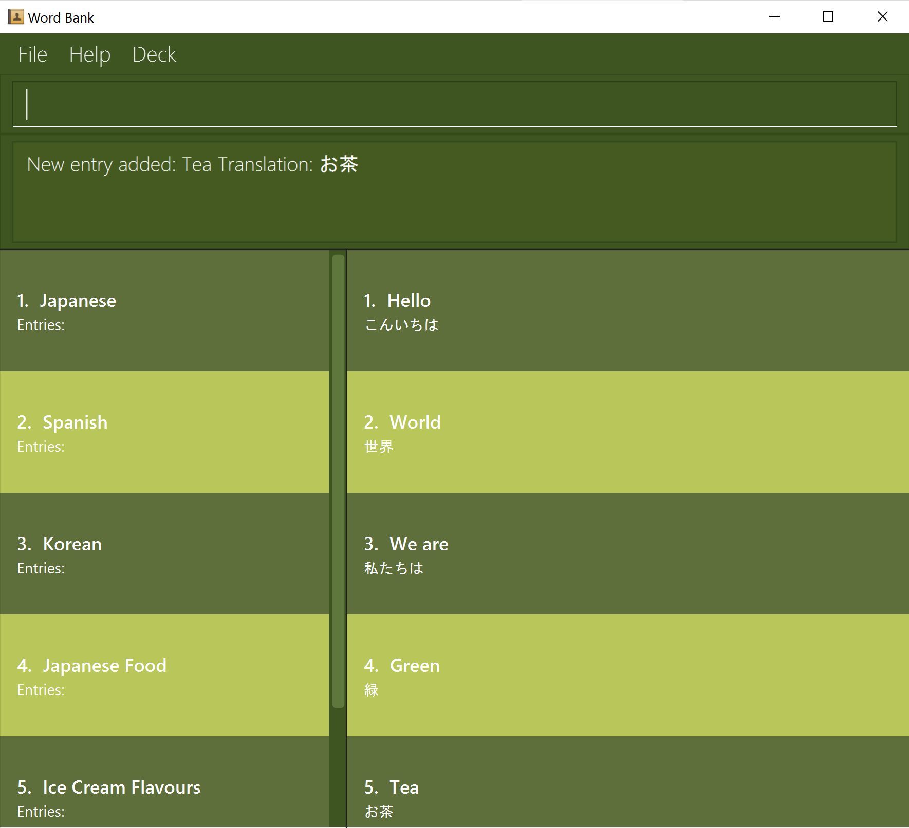

# Green Tea
## The Revolutionary Language Learning Application

(NEW UI COMING SOON)

* The project is a platform for users to record words of various languages with their translations
  * It is designed for use with a **CLI** (Command Line Interface)
  * It comes with a **reasonable level of user and developer documentation**.
* For the detailed documentation of this project, see the **[Address Book Product Website](https://se-education.org/addressbook-level3)**.
* This project is based on the AddressBook-Level3 project created by the [SE-EDU initiative](https://se-education.org).
