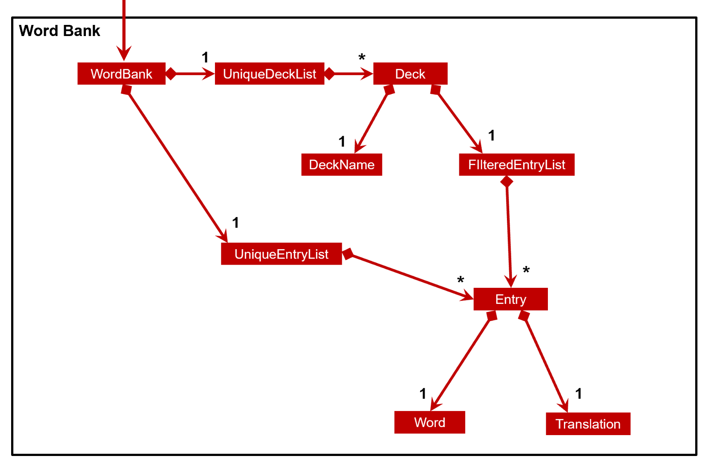

## Green Tea Developer Guide (v1.2)

### Table of Contents

- [1. Introduction](#1-introduction)
  - [1.1 Purpose](#11-purpose)
  - [1.2 Audience](#12-audience)
  - [1.3 Glossary](#13-glossary)
- [2. Setting up, getting started](#2-setting-up-getting-started)
- [3. Design](#3-design)
  - [3.1 Component Overview](#31-component-overview)
  - [How the architecture components interact with one another](#how-the-architecture-components-interact-with-one-another)
  - [3.2 Common classes](#32-common-classes)
  - [3.3 UI component](#33-ui-component)
  - [3.4 Logic component](#34-logic-component)
  - [3.5 Model component](#35-model-component)
  - [3.6 Storage component](#36-storage-component)
  - [3.7 PhaseManager component](#37-phasemanager-component)
- [4. Implementation](#4-implementation)
  - [4.1 Deck System](#41-deck-system)
  - [4.2 Select Deck](#42-select-deck)
  - [4.3 [Proposed] Flashcard System](#43-proposed-flashcard-system)
  - [4.4 [Proposed] Data Analysis](#44-proposed-data-analysis)
- [5. Documentation, logging, testing, configuration, dev-ops](#5-documentation-logging-testing-configuration-dev-ops)
- [6. Appendix: Requirements](#6-appendix-requirements)
  - [6.1 Product scope](#61-product-scope)
  - [6.2 User stories](#62-user-stories)
  - [6.3 Use cases](#63-use-cases)
  - [6.4 Non-Functional Requirements](#64-non-functional-requirements)
  - [6.5 Glossary](#65-glossary)
- [7. Appendix: Instructions for manual testing](#7-appendix-instructions-for-manual-testing)
  - [7.1 Launch and shutdown](#71-launch-and-shutdown)
  - [7.2 Removing a deck](#72-removing-a-deck)
  - [Saving data](#saving-data)

---

## 1. Introduction

### 1.1 Purpose

This document details the architecture, design decisions and implementations for the flashcard application, Green Tea.

### 1.2 Audience

The intended audience of this document are the developers and testers of Green Tea.

### 1.3 Glossary

| Syntax    | Description     |
| --------- | -------------------------- |
| Deck      | A collection of entries    |
| Entry     | A word and its translation |
| Word Bank | A collection of decks.     |

Table 1. Syntax and Description of Technical Terms in GreenTea

---

## 2. Setting up, getting started

Refer to the guide [_Setting up and getting started_](SettingUp.md).

---

## 3. Design

This section details the various components of the application. It covers the internal structure of each component and
how the components work together with one another.

### 3.1 Component Overview

The components of the application are Main, Commons, UI, Logic, Model and Storage.

<

Figure 1.Overview of components and their relationships 

The **_Component Overview Diagram_** above shows the high-level design of the application.
Given below is a quick overview of each component.

:bulb: **Tip:** The `.puml` files used to create diagrams in this document can be found in the [diagrams](https://github.com/se-edu/addressbook-level3/tree/master/docs/diagrams/) folder. Refer to the [_PlantUML Tutorial_ at se-edu/guides](https://se-education.org/guides/tutorials/plantUml.html) to learn how to create and edit diagrams.

**`Main`** has two classes called [`Main`](https://github.com/AY2021S1-CS2103T-T09-4/tp/blob/master/src/main/java/seedu/address/Main.java) and [`MainApp`](https://github.com/AY2021S1-CS2103T-T09-4/tp/blob/master/src/main/java/seedu/address/MainApp.java).
It is responsible for:

- At app launch: Initializes the components in the correct sequence and connects them up with each other.
- At shut down: Shuts down the components and invokes cleanup methods where necessary.

[**`Commons`**](#common-classes) represents a collection of classes used by multiple other components.

The rest of the App consists of four components.

- [**`UI`**](#ui-component): The UI of the App.
- [**`Logic`**](#logic-component): The command executor.
- [**`Model`**](#model-component): Holds the data of the App in memory.
- [**`Storage`**](#storage-component): Reads data from, and writes data to, the hard disk.

Each of the four components,

- defines its _API_ in an `interface` with the same name as the Component.
- exposes its functionality using a concrete `{Component Name}Manager` class (which implements the corresponding API `interface` mentioned in the previous point.

For example, the `Logic` component (see the class diagram given below) defines its API in the `Logic.java` interface and exposes its functionality using the `LogicManager.java` class which implements the `Logic` interface.

 Figure 2. Example of a component's API and functionality

#### How the architecture components interact with one another

The _Sequence Diagram_ below shows how the components interact with each other for the scenario where the user issues the command `remove 1`.

 Figure 3. Components interacting with one another

The sections below give more details of each component.

### 3.2 Common classes

Common classes are classes used by multiple components. Common classes include:

- `Index`: Represents a zero or one based index. Using `Index` removes the need for a component to know what base other
  components are using for their index. Can be converted to an integer (int).
- `Messages`: Stores messages to be displayed to the user.
- `GuiSettings`: Contains the GUI settings.
- `LogsCenter`: Writes messages to the console and a log file. Records the state of the program as the app is running.

### 3.3 UI component

 Figure 4. UI component class relationship diagram 

**API** :
[`Ui.java`](https://github.com/AY2021S1-CS2103T-T09-4/tp/blob/master/src/main/java/seedu/address/ui/Ui.java)

The `UI` component,

- Executes user commands using the `Logic` component.
- Listens for changes to `Model` data so that the UI can be updated with the modified data.

The UI consists of a `MainWindow` that is made up of parts (`CommandBox`, `ResultDisplay`, `PersonListPanel`, `StatusBarFooter`)
All these, including the `MainWindow`, inherit from the abstract `UiPart` class.

The `UI` component uses JavaFx UI framework. The layout of these UI parts are defined in matching `.fxml` files that are in the `src/main/resources/view` folder.
For example, the layout of the [`MainWindow`](https://github.com/AY2021S1-CS2103T-T09-4/tp/blob/master/src/main/java/seedu/address/ui/MainWindow.java) is specified in [`MainWindow.fxml`](https://github.com/AY2021S1-CS2103T-T09-4/tp/blob/master/src/main/resources/view/MainWindow.fxml)

`MainWindow.fxml` - Houses the rest of the fxml (commandBox,HelpWindow, etc) in the VBox. Contains the code for the actual menu bar

`CommandBox.fxml` - Stackpane where the user writes input

`DeckListPanel.fxml` - Houses a ListView<Deck>

`DeckListCard.fxml` - (not housed by Mainwindow.fxml) contains the data from each deck

`EntryListPanel.fxml` - Houses a ListView<Entry>

`EntryListCard.fxml`- (not housed by Mainwindow.fxml) contains the data from each entry

`HelpWindow.fxml` - Only displays label and copy url button

`ResultDisplay.fxml` - Prints results to user

`StatusBarFooter` - returns the path of the file retrieved

### 3.4 Logic component

**API** :
[`Logic.java`](https://github.com/AY2021S1-CS2103T-T09-4/tp/blob/master/src/main/java/seedu/address/logic/Logic.java)

 Figure 5. Logic component class relationship diagram

1. `Logic` uses the `WorkBankParser` class to parse the user command.
1. This results in a `Command` object which is passed to `LogicManager`.
   1. The `Command` is first checked by `PhaseManager` whether it can be executed in the current `Phase`.
   1. If yes, execute the `Command`; otherwise, throw `PhaseIncorrectException`.
1. The command execution can affect the `Model` (e.g. adding a deck).
1. The result of the command execution is encapsulated as a `CommandResult` object which is passed back to the `Ui`.
1. In addition, the `CommandResult` object can also instruct the `Ui` to perform certain actions, such as displaying help to the user.

Given below is the Sequence Diagram for interactions within the `Logic` component for the `execute("delete 1")` API call.

 Figure 6. Interactions between different parts of the logic component

### 3.5 Model component

 Figure 7. Model component class relationship diagram

Figure 7 shows a general overview of the model component. The diagram below will give more details about the
word bank section of the model component.

 Figure 8. Structure of classes in the word bank

**API** : [`Model.java`](https://github.com/AY2021S1-CS2103T-T09-4/tp/blob/master/src/main/java/seedu/address/model/Model.java)

The `Model`

- stores a `UserPref` object that represents the user’s preferences.
- stores a `FilteredList<Deck>` object that maintain`s the current list of decks in memory.
- exposes an unmodifiable `ObservableList<Deck>`  and `ObservableList<Entry>`  
that can be 'observed'. E.g. the UI can be bound to this list so that the UI automatically updates when the data in the list change.
- does not depend on any of the other three components.

### 3.6 Storage component

 Figure 9. Storage component class relationship diagram

**API** : [`Storage.java`](https://github.com/AY2021S1-CS2103T-T09-4/tp/blob/master/src/main/java/seedu/address/storage/Storage.java)

The `Storage` component,

- can save `UserPref` objects in json format and read it back.
- can save the word bank data, such as `Deck`, `Entry`, `Word` and `Translation` in json format and read it back.
- can save the statistics and scores of each individual quiz

Each Word and Translation is saved in a JsonAdaptedWord and JsonAdaptedTranslation object respectively.
Each Entry is saved in a JsonAdaptedEntry object, consisting of a JsonAdaptedWord and JsonAdaptedTranslation.
Each Deck is saved in a JsonAdaptedDeck object, consisting of a list of JsonAdaptedEntry.

This format allows the files to be saved in json format and be read back accurately.

### 3.7 PhaseManager component

 Figure 10. PhaseManager component diagram (WIP)

**API** : [`PhaseManager.java`](https://github.com/AY2021S1-CS2103T-T09-4/tp/blob/master/src/main/java/seedu/address/logic/phase/PhaseManager.java)

The `PhaseManager` component serves the following functions:

- Keep track of the current `Phase` (`LOBBY`, `QUIZ`, `RESULTS`) the app is in.
- Validate whether a `Command` can be executed in the current `Phase`.
- Check whether a `Command` is a `PhaseTransitionCommand` and if so, update the `Phase` to be the `nextPhase` specified by this `PhaseTransitionCommand`.

---

## 4. Implementation

This section describes some noteworthy details on how and why certain features are implemented.

### 4.1 Deck System (Melanie)

This feature allows the user to create multiple lists of entries rather than having
all entries together in the same list. The user could have different decks
for different languages or multiple decks for the same language.

E.g.

- Deck 1: Japanese
- Deck 2: Spanish Food
- Deck 3: Spanish Animals

#### Design Considerations

The rationale behind the deck system is so that users will be better able to organize their entries.
A deck system will also allow the flashcard system, a proposed feature, to be implemented more easily.

### 4.2 Select Deck (Melanie)

This feature requires the user to select a deck (using `select <index>`) in order to change the contents of the deck.
Once a deck is selected, entry level operations such as `add`, `delete`, `find`, `list` can be performed.

The implementation of this feature requires the GUI to be updated whenever a deck is selected. This is done by using the
UI, Logic and Model components. The selected deck is retrieved from `FilteredList<Deck>` in the model component and replaces
the current entries in the `UniqueEntryList` object of WordBank causing the UI to change accordingly. A similar
approach is done for other commands that changes the UI such as `new <deck>` and `clear` command

#### Design Considerations

##### Aspect: Command format to select a deck

- **Alternative 1 (current choice)**: `select <deck_index>` Select a deck before any entry level command can be given.
  E.g. `select 1` followed by `delete 1`
  - Pros: Easier for a user to make continuous changes to the same deck
  - Cons: Users have to give an additional command
- **Alternative 2**: `delete <deck_index> <entry_index>` Entry level commands specify a deck. E.g `delete 1 1`
  - Pros: Single command for users to execute
  - Cons: May cause confusion to the users.

### 4.3 Flashcard System (Gabriel)

Three additional commands are used for the flashcard system -  PlayCommand, StopCommand and AnswerCommand.

By default, StopCommand and AnswerCommand cannot be accessed by the user until a PlayCommand is typed by the user.

 Figure 11. Sequence Diagram of Play Command

With reference to Figure 11, after a PlayCommand is created:
* A boolean isPlayMode in AddressBookParser becomes True (not shown yet as the implementation might change). 
* All following user inputs are treated as either an AnswerCommand or a StopCommand
* A Leitner object is created that stores the current entries of the selected deck and shuffles them
* The Leitner object also forms questions and answers list based on the shuffled list

 Figure 12. Sequence Diagram of Play Command

With reference to figure 12, when the user types a AnswerCommand into the system:
 * The AddressBookParser first checks if it is current is in play mode via the boolean isPlayMode
 * If it is not in play mode, an error message is shown to the user via the UI
 * If it is in play mode, an AnswerCommand containing hte user input is sent to the model and checked against
  the current question in Leitner.java
 * The response (correct / wrong answer) is then relayed backed to the user and the next question is loaded.
 * The process ends when the Leitner.java has no more question to ask (not shown as implementation might change)

__The diagram for this process will be created after the flashcard system is implemented__

#### Design Considerations:

##### Aspect: Type of flashcard system

- **Alternative 1 (current choice)** : Leitner System
  - Pros: The Letiner system is a proven quizzing system that increases the user's rate of learning by
          using spaced repetition. Flashcards are sorted based on the user's ability to answer them. Correctly
          answered flashcards are put at the end of the question queue and incorrectly answered
          flashcards are placed at the front.
          (https://en.wikipedia.org/wiki/Leitner_system)
  - Cons: More difficult to implement
- **Alternative 2** : Random shuffling system
  - Pros: Easier to implement
  - Cons: Users may not learn as effectively

### 4.4 \[Proposed\] Data Analysis

Some of the proposed parameters tracked by GreenTea include:

- Number of correctly answered flashcards
- Previous scores
- Average time taken in total
- Time of quiz

From these data, GreenTea would be able to derive some meaningful analytics to
display to the user. These include:

- Progression since last attempt
- Length of time between quizzes
- Most forgotten phrase/translation
- Language mastery
- Progress in each deck

_{Feature will be added in v1.3.2}_

---

## 5. Documentation, logging, testing, configuration, dev-ops

- [Documentation guide](Documentation.md)
- [Testing guide](Testing.md)
- [Logging guide](Logging.md)
- [Configuration guide](Configuration.md)
- [DevOps guide](DevOps.md)

---

## 6. Appendix: Requirements

### 6.1 Product scope

**Target user profile**:

- has a need to learn and practice a language
- wants to remember the meaning and spelling of words in a new language
- prefers question based testing to learn a language
- prefer desktop apps over other types
- can type fast
- prefers typing to mouse interactions
- is reasonably comfortable using CLI apps

**Value proposition**: helps users learn a language better through a flashcard system

### 6.2 User stories

Priorities: High (must have) - `* * *`, Medium (nice to have) - `* *`, Low (unlikely to have) - `*`

| Priority | As a …​  | I want to …​                                | So that I can…​                                        |
| -------- | -------- | ------------------------------------------- | ------------------------------------------------------ |
| `* * *`  | new user | see usage instructions                      | refer to instructions when I forget how to use the App |
| `* * *`  | user     | add a Word-Meaning pair                     | populate the list with words and their meanings        |
| `* * *`  | user     | delete a Word-Meaning pair                  | delete an unwanted entry                               |
| `* * *`  | user     | edit a Word-Meaning pair                    | edit an entry                                          |
| `* *`    | user     | assign a Difficulty Ranking to words        | determine which words are more difficult for me        |
| `* * *`  | user     | access a Dictionary of Word-Meaning pairs   | refresh my understanding of the words                  |
| `* * *`  | user     | search the dictionary with a word           | find out its meaning                                   |
| `* * *`  | user     | search the dictionary with a meaning        | find out the word                                      |
| `* *`    | user     | sort the Dictionary by difficulty           | view the more difficult words in the dictionary        |
| `* * *`  | user     | create a question                           | test my understanding of a word                        |
| `* * *`  | user     | create a multiple choice question           | choose the correct answer                              |
| `* * *`  | user     | create an open-ended question               | test my spelling and understanding of the word         |
| `* * *`  | user     | delete a question                           | delete an unwanted entry                               |
| `* * *`  | user     | edit a question                             | delete an unwanted entry                               |
| `* * *`  | user     | access the list of questions                | view all the questions                                 |
| `*`      | user     | tag a question with a difficulty rating     | create a quiz based on difficulty rating               |
| `* * *`  | user     | create a quiz from the pool of questions    | attempt the questions                                  |
| `* * *`  | user     | submit the quiz                             | see my results                                         |
| `* *`    | user     | have a timer                                | find out how long I took to complete the quiz          |
| `* *`    | user     | view statistics of the quiz                 | gauge my strengths and weaknesses                      |
| `* *`    | user     | have a Rating System based on quiz results  | know my progress so far in learning the language       |
| `* *`    | user     | view all the quiz scores                    | know how I performed for each quiz                     |
| `* *`    | user     | go back one question in the quiz            | review the question                                    |
| `* *`    | user     | skip a question in the quiz                 | skip a question and come back later                    |
| `* *`    | user     | have a reminder of any incomplete questions | know if my quiz is complete                            |
| `*`      | user     | view hints for the quiz                     | have help when I am stuck on a difficult question      |
| `*`      | user     | test my spelling                            | learn how to spell the words correctly                 |
| `*`      | user     | test a sentence structure                   | learn the grammar of the language                      |
| `*`      | user     | have a reminder to practice everyday        | continue my progress consistently                      |

_{More to be added}_

### 6.3 Use cases

(For all use cases below, the **System** is `GreenTea` and the **Actor** is the `user`, unless specified otherwise)

**Use case 1: View help**

**MSS**

1.  User requests help
2.  GreenTea returns a message explaining how to access the help page
    Use case ends.

**Use case 2: Add a new entry**

**MSS**

1.  User requests to add a new entry
2.  GreenTea add the new entry

    Use case ends.

**Extensions**

- 1a. The entry is invalid

  - 1a1. GreenTea shows an error message

  Use case ends.

- 1b. The entry is valid.

  Use case resumes at step 2.

**Use case 3: List all entries**

**MSS**

1.  User requests to see the list of entries
2.  GreenTea shows a list of entries

    Use case ends.

**Use case 4: Edit an entry**

**MSS**

1.  User requests to edit an entry with updated fields via the given index
2.  GreenTea updates entry with new fields

    Use case ends.

**Extensions**

- 1a. User gives an invalid index

  - 1a1. GreenTea returns an error message

  Use case ends.

**Use case 5: Delete an entry**

**MSS**

1.  User requests to list entries
2.  GreenTea shows a list of entries
3.  User requests to delete a specific entry in the list via the given index
4.  GreenTea deletes the person

    Use case ends.

**Extensions**

- 3a. The given input does not match the format

  - 3a1. GreenTea shows an error message
   
    Use case resumes at step 2.

- 3b. The given index is invalid.

  - 3b1. GreenTea shows an error message.

    Use case resumes at step 2.

**Use case 6: Clear decks**

**MSS**

1.  User requests to clear decks
2.  GreenTea clears all decks

    Use case ends.

**Use case 7: Exit**

**MSS**

1.  User requests to exit program
2.  GreenTea exits

    Use case ends.

_{More to be added}_

### 6.4 Non-Functional Requirements

1.  Should work on any _mainstream OS_ as long as it has Java `11` or above installed.
2.  Should be able to hold up to 1000 entries without a noticeable sluggishness in performance for typical usage.
3.  A user with above average typing speed for regular English text (i.e. not code, not system admin commands) should be able to accomplish most of the tasks faster using commands than using the mouse.
4.  Should be easy for new users to understand, use and navigate the UI
5.  Any interface between a user and the system should have a maximum response time of 2 seconds
6.  Any reused code should be acknowledged in the README

_{More to be added}_

### 6.5 Glossary

- **Mainstream OS**: Windows, Linux, Unix, OS-X
- **Private contact detail**: A contact detail that is not meant to be shared with others

---

## 7. Appendix: Instructions for manual testing

Given below are instructions to test the app manually.

:information_source: **Note:** These instructions only provide a starting point for testers to work on;
testers are expected to do more *exploratory* testing.

### 7.1 Launch and shutdown

Initial launch

1.  Download the jar file and copy into an empty folder

2.  Double-click the jar file Expected: Shows the GUI with a set of sample contacts. The window size may not be optimum.

Saving window preferences

1.  Resize the window to an optimum size. Move the window to a different location. Close the window.

2.  Re-launch the app by double-clicking the jar file. 
    Expected: The most recent window size and location is retained.

_{ more test cases …​ }_

### 7.2 Removing a deck

Removing a deck while all decks are being shown

1.  Prerequisites: Multiple decks in the list.

2.  Test case: `remove 1` 
    Expected: First deck is removed from the list. Status message shown to confirm that the deck has been deleted. Timestamp in the status bar is updated.

3.  Test case: `remove 0` 
    Expected: No deck is removed. Error details shown in the status message. Status bar remains the same.

4.  Other incorrect remove commands to try: `remove`, `remove asdf`, `remove x`, `...` (where x is larger than the list size) 
    Expected: Similar to previous test case 3

_{ more test cases …​ }_

### Saving data

Dealing with missing/corrupted data files

1.  _{explain how to simulate a missing/corrupted file, and the expected behavior}_

_{ more test cases …​ }_
