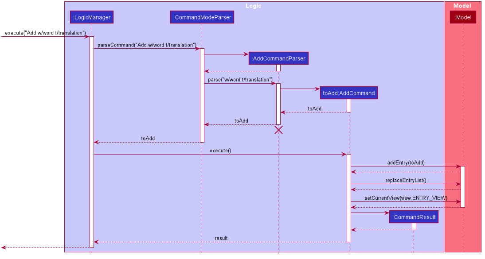

## Green Tea Developer Guide (v1.4)

### Table of Contents

- [Green Tea Developer Guide (v1.4)](#green-tea-developer-guide-v14)
  - [Table of Contents](#table-of-contents)
- [1. Introduction](#1-introduction)
  - [1.1 Purpose](#11-purpose)
  - [1.2 Audience](#12-audience)
- [2. Setting up, getting started](#2-setting-up-getting-started)
- [3. Design](#3-design)
  - [3.1 Component Overview](#31-component-overview)
  - [How the architecture components interact with one another](#how-the-architecture-components-interact-with-one-another)
  - [3.2 Common classes](#32-common-classes)
  - [3.3 UI component](#33-ui-component)
  - [3.4 Logic component](#34-logic-component)
  - [3.5 Model component](#35-model-component)
  - [3.6 Storage component](#36-storage-component)
- [4. Implementation](#4-implementation)
  - [4.1 Deck Feature (Melanie)](#41-deck-feature-melanie)
  - [4.1.1 Overview](#411-overview)
  - [4.1.2 Commands Implemented](#412-commands-implemented)
  - [4.1.3 Select Deck](#413-select-deck)
  - [4.2 Flashcard System (Gabriel)](#42-flashcard-system-gabriel)
  - [Design Considerations:](#design-considerations-2)
    - [Aspect: Type of flashcard system](#aspect-type-of-flashcard-system)
  - [4.3 [Proposed] Data Analysis](#43-proposed-data-analysis)
- [5. Documentation, logging, testing, configuration, dev-ops](#5-documentation-logging-testing-configuration-dev-ops)
- [6. Appendix: Requirements](#6-appendix-requirements)
  - [6.1 Product scope](#61-product-scope)
  - [6.2 User stories](#62-user-stories)
  - [6.3 Use cases](#63-use-cases)
  - [6.4 Non-Functional Requirements](#64-non-functional-requirements)
  - [6.5 Glossary](#65-glossary)
- [7. Appendix: Instructions for manual testing](#7-appendix-instructions-for-manual-testing)
  - [7.1 Launch and shutdown](#71-launch-and-shutdown)
  - [7.2 Removing a deck](#72-removing-a-deck)
  - [Saving data](#saving-data)

---

## 1. Introduction

Green Tea is a flashcard application, designed for users who want to practice their language skills and
keep track of their learning progress.

### 1.1 Purpose

This document details the architecture, design decisions and implementations for the flashcard application, Green Tea.

### 1.2 Audience

The intended audience of this document are the developers and testers of Green Tea.

---

## 2. Setting up, getting started

Refer to the guide [_Setting up and getting started_](SettingUp.md).

---

## 3. Design

This section details the various components of the application. It covers the internal structure of each component and
how the components work together with one another.

### 3.1 Component Overview

The components of the application are Main, Commons, UI, Logic, Model and Storage.

<

Figure 1.Architecture Diagram 

The **_Component Overview Diagram_** above shows the high-level design of the application.
Given below is a quick overview of each component.

:bulb: **Tip:** The `.puml` files used to create diagrams in this document can be found in the [diagrams](https://github.com/se-edu/addressbook-level3/tree/master/docs/diagrams/) folder. Refer to the [_PlantUML Tutorial_ at se-edu/guides](https://se-education.org/guides/tutorials/plantUml.html) to learn how to create and edit diagrams.

**`Main`** has two classes called [`Main`](https://github.com/AY2021S1-CS2103T-T09-4/tp/blob/master/src/main/java/seedu/address/Main.java) and [`MainApp`](https://github.com/AY2021S1-CS2103T-T09-4/tp/blob/master/src/main/java/seedu/address/MainApp.java).
It is responsible for:

- At app launch: Initializes the components in the correct sequence and connects them up with each other.
- At shut down: Shuts down the components and invokes cleanup methods where necessary.

[**`Commons`**](#32-common-classes) represents a collection of classes used by multiple other components.

The rest of the App consists of four components.

- [**`UI`**](#33-ui-component): The UI (User Interface) of the App.
- [**`Logic`**](#34-logic-component): The command executor.
- [**`Model`**](#35-model-component): Holds the data of the App in memory.
- [**`Storage`**](#36-storage-component): Reads data from, and writes data to, the hard disk.

Each of the four components:

- Defines its _API_ in an `interface` with the same name as the Component.
- Exposes its functionality using a concrete `{Component Name}Manager` class (which implements the corresponding API `interface` mentioned in the previous point.

For example, the `Logic` component (see the class diagram given below) defines its API in the `Logic.java` interface and exposes its functionality using the `LogicManager.java` class which implements the `Logic` interface.

 Figure 2. Example Class Diagram of the Logic Component

#### How the architecture components interact with one another

The _Sequence Diagram_ below (Figure 3) shows how the components interact with one another when the user issues the command `remove 1`.

 Figure 3. Sequence Diagram of Various Components

The sections below give more details about each component.

### 3.2 Common classes

Common classes are classes used by multiple components.
They can be found in the `seedu.addressbook.commons` package.

Common classes include:

- `Index`: Represents a zero or one based index. Using `Index` removes the need for a component to know what base other
  components are using for their index. Can be converted to an integer (int).
- `Messages`: Stores messages to be displayed to the user.
- `GuiSettings`: Contains the GUI settings.
- `LogsCenter`: Writes messages to the console and a log file. Records the state of the program as the app is running.

### 3.3 UI component

The `UI` component is the portion of the application which is visible to the user.
The `UI` consists of a `MainWindow` that is made up of various parts (E.g `CommandBox`, `ResultDisplay`, `DeckListPanel`, `StatusBarFooter`)
All these, including the `MainWindow`, inherit from the abstract `UiPart` class.

The structure diagram of the `UI` component is shown below in Figure 4.

 Figure 4. UI component class relationship diagram 

**API** :
[`Ui.java`](https://github.com/AY2021S1-CS2103T-T09-4/tp/blob/master/src/main/java/seedu/address/ui/Ui.java)

Role of the `Ui` component:

- Receives the user input.
- Executes user commands using the `Logic` component.
- Listens for changes to `Model` data so that the `Ui` can be updated with the modified data.

The `Ui` component uses the JavaFx UI framework. The layout of these UI parts are defined in matching `.fxml` files that are in the `src/main/resources/view` folder.

For example, the layout of the [`MainWindow`](https://github.com/AY2021S1-CS2103T-T09-4/tp/blob/master/src/main/java/seedu/address/ui/MainWindow.java) is specified in [`MainWindow.fxml`](https://github.com/AY2021S1-CS2103T-T09-4/tp/blob/master/src/main/resources/view/MainWindow.fxml)

`MainWindow.fxml` - Houses the rest of the fxml (commandBox,HelpWindow, etc) in the VBox. Contains the code for the actual menu bar

`CommandBox.fxml` - Takes in the user input and passes it to `MainWindow` which will pass the input to `Logic`

`DeckListPanel.fxml` - Houses a ListView<Deck>

`EntryListPanel.fxml` - Houses a ListView<Entry>

`EntryListCard.fxml`- Contains the word and translation data of each entry. Note that it is not housed by MainWindow.fxml

`QuizPanel.fxml` - Displays quiz information to the user

`ScorePanel.fxml` - Displays quiz score to the user only after a quiz has ended

`StartPanel.fxml` - Displays green tea icon and some sample commands to the user

`StatisticsPanel.fxml` - Displays the statistics of past quizzes to the user

`HelpWindow.fxml` - Displays label and copy url button

`ResultDisplay.fxml` - Prints results to user

`StatusBarFooter.fxml` - Returns the path of the file retrieved

:information_source: **Note:**

`MainWindow.fxml` contains a **tabPanel** which switches between 4 panels depending on the command given by the user.
Commands update a class called `CurrentView.java` in `Model`. Based on the current view, the tab panel will be updated accordingly

- Panel which shows upon _starting the application_ is `StartPanel.fxml`.
- Panel which shows upon _selecting a deck_ is `EntryListPanel.fxml`.
- Panel which shows upon _starting a quiz game_ is `QuizPanel.fxml`.
- Panel which shows upon _giving stats command_ is `StatisticsPanel.fxml`.

### 3.4 Logic component

The `Logic` component is the bridge between the `UI` and `Model` components. It is in charge of deciding what to do with the
user input received from the `UI`. This component consists of the `Statistics`, `Parser` and the `Command` package.

The class diagram of the `Logic` component is shown below in Figure 5.

 Figure 5. Logic Component Class Diagram

**API** :
[`Logic.java`](https://github.com/AY2021S1-CS2103T-T09-4/tp/blob/master/src/main/java/seedu/address/logic/Logic.java)

Role of the `Logic` component:
- `Logic` receives the user command.
- `Logic Manager` can either be in `Play Mode` or in `Command Mode`.
- Uses the `PlayModeParser` or the `CommandModeParser` class to parse the user command depending on the mode it is in.
- Creates a `Command` object which is passed and executed by `LogicManager`.
- Executing the command can affect the `Model` (e.g. adding a deck).
- Returns the result of the command execution as a `CommandResult` object which is passed back to the `Ui`.
- Initialises the `StatisticsManager` on startup via `LogicManager` and maintains the `Statistics`.
- Any changes from executing a `Command` object is recorded in `Statistics` by `Statistics Manager`.
- In addition, the `CommandResult` object can also instruct the `Ui` to perform certain actions, such as displaying help to the user.

Role of the `Parser` package:
- Derives the command word and the arguments of the user input
- Throws a `ParserException` if the command word or argument are not correctly written

Role of the `Statistics` package:
- Maintains the `Statistics` of the all the decks in memory
- More explained under [Implementations - Statistics](#43-implementaion-not-written-yet)

Role of the `Command` package:
- Contains the instructions for `Model`
- Throws a `CommandException` if an error occurs between execution and obtaining `CommandResult`

Given below is the Sequence Diagram for interactions within the `Logic` component for the `execute("delete 1")` API call.

 Figure 6. Sequence Diagram of Logic Component for "Remove 1" Command

### 3.5 Model component

The `Model` component is in charge of changing the data within the application.
This includes information about decks, entries and statistics.
The `Model` component consists of the `Play`, `Deck` and `View` package. The `Play` package consists of the `Scoring` package,
`Leitner` object and the `Score` object. The `Deck` package consists of the `Entry` package, the `Deck` object and
all other similar object.

All these information on the `Model` component is visually expressed in the class diagram below.

 Figure 7. Model Component Class Diagram

The diagram below will give more details about the word bank section of the model component.

**API** : [`Model.java`](https://github.com/AY2021S1-CS2103T-T09-4/tp/blob/master/src/main/java/seedu/address/model/Model.java)

Role of `Model` component:

- Stores a `UserPref` object that represents the user’s preferences.

- Stores a `CurrentView` object that represents the current tab view on the UI.
- Stores a `WordBank` component that maintains all the current `Entry` and `Deck` data.
- Stores a `FilteredList<Deck>` object that maintains the current list of `Deck` in memory for error checking purposes.
- Creates and maintains a `Leitner` object and a `QuizAttempt` object using a selected deck from `FilteredList<Deck>` if
  a `PlayCommand` object is executed by `Logic`.

Role of `WordBank` component

- Maintains all the current `Entry` and `Deck` data.
- Stores a `FilteredList<Entry>` object that maintains the current list of `Entry` in memory.
- Exposes an unmodifiable `ObservableList<Deck>` and `ObservableList<Entry>`
  that can be 'observed'. E.g. the UI can be bound to this list so that the UI automatically updates when the data in the list change.

Role of `Leitner` object:

- Shuffles a given `Deck` by decomposing it into a list of `Translations` and a list of `Word` called questions and answers respectively.
- Returns each `Translation` (question)) and `Word` (answer) when called by `ModelManager`.
- More explained under [Implementations - Flashcard](#42-flashcard-system-gabriel)

Role of `QuizAttempt` object:
- Maintains the list of current `Score` and `QuestionAttempt` of the quiz.
- More explained under [Implementations - Flashcard](#42-flashcard-system-gabriel)

### 3.6 Storage component

The `Storage` component handles the reading and writing of data from a data file. By storing the data,
the application will be able to load the data from the previous session back to the user when the user opens
the application.
The class diagram of the `Storage` component is shown below.

 Figure 8. Storage Component Class Diagram

**API** : [`Storage.java`](https://github.com/AY2021S1-CS2103T-T09-4/tp/blob/master/src/main/java/seedu/address/storage/Storage.java)

The `Storage` component,

- Saves`UserPref` objects in json format and read it back.
- Saves the word bank data, such as `Deck`, `Entry`, `Word` and `Translation` in json format and read it back.
- Saves the statistics and scores of each individual quiz taken by the user.

Each `Word` and `Translation` is saved in a `JsonAdaptedWord`and `JsonAdaptedTranslation` object respectively.
Each `Entry` is saved in a `JsonAdaptedEntry` object, consisting of a `JsonAdaptedWord` and `JsonAdaptedTranslation`.
Each `Deck` is saved in a `JsonAdaptedDeck` object, consisting of a list of `JsonAdaptedEntry`.

This format allows the files to be saved in json format and be read back accurately.

:information_source: **Note:** An alternative (arguably, a more OOP) model is given below. It has a `Tag` list in the `TrackPad`, which `Attraction` references. This allows `TrackPad` to only require one `Tag` object per unique `Tag`, instead of each `Attraction` needing their own `Tag` object.
 

<i>Figure 9 More OOP Storage Class Diagram</i>
 

---

## 4. Implementation

This section describes some noteworthy details on how and why certain features are implemented.

### 4.1 Deck Feature (Melanie)

#### 4.1.1 Overview

This feature allows the user to create multiple lists of entries called decks.
The user can have different decks for different languages or multiple decks for the same language.

E.g.

- Deck 1: Japanese
- Deck 2: Spanish Food
- Deck 3: Spanish Animals

Users will be able to `add` decks, `delete` decks and `select` decks.

##### Design Considerations

###### Aspect: One long list of entries or deck system

- **Alternative 1 (current choice)**: Deck system

  - Pros: Users are better able to organize their entries into groups.
    Commands such as `find` and `list` to filter entries are no longer needed.
    Allows [flashcard system](#42-flashcard-system-gabriel) to be implemented more easily.
    Higher level of abstraction.
  - Cons: Harder to implement, more code and commands required

- **Alternative 2**: One long list of entries
  - Pros: Easier implementation, less code required.
  - Cons: Harder for users to navigate and find the entry that they are looking for.

#### 4.1.2 Commands Implemented

Three commands are used in order to support having a deck system - New Deck Command, Remove Deck Command and Select Command

- `new <DECK>` - Adds a new deck to the word bank.
- `remove <INDEX>` - Removes the deck at the specified index.
- `select <INDEX>` - Selects the deck at the specified index.

Each of these three commands require the use of the `UI`, `Logic` and `Model` components.
For example, when a deck is added, the `model` must be updated with a new deck list containing the added deck. The
`UI` must also reflect the added deck to be shown to the user.
The `Storage` component is needed for commands `new` and `remove`

#### 4.1.3 Select Deck

This feature requires the user to select a deck (using `select <index>`) in order to change the contents of the deck.
Only after selecting a deck, can some other commands (E.g `add`, `delete`, `edit`, `/play`) be performed.

:information_source: **Note:**

The implementation of this feature requires the GUI to be updated whenever a deck is selected. This is done by using the
UI, Logic and Model components.

- The selected deck is retrieved from `FilteredList<Deck>` in the model component.
- These entries in the selected deck replaces the current entries in the `UniqueEntryList` object of WordBank causing the GUI to change accordingly.
- This approach is used for other commands that changes the GUI such as `add <entry>` and `clear` command

##### Design Considerations

###### Aspect: Command format to select a deck

- **Alternative 1 (current choice)**: `select <deck_index>` Select a deck before any entry level command can be given.
  E.g. `select 1` followed by `delete 1`

  - Pros: Easier for a user to make continuous changes to the same deck
    Allows following features to be implemented more easily
  - Cons: Users have to give an additional command

- **Alternative 2**: `delete <deck_index> <entry_index>` Entry level commands specify a deck. E.g `delete 1 1`
  - Pros: Single command for users to execute
  - Cons: May cause confusion to the users.

Utimately, we decided that user navigability was more important than the extra `select` command needed. This is because
Green Tea is designed to be a simple and easy system for new users to use.

### 4.2 Flashcard System (Gabriel)

The `Flashcard System` is a feature that allows the user to quiz themselves on a selected deck's entries.
The user can quiz themselves after ensuring a deck is already selected using a `SelectCommand` and then 
invoking a `PlayCommand`. This feature will also keep track and update the score of the quiz.

The `SelectCommand` follows the format: `select <index>`. 

The `PlayCommand` follows the format: `/play`.

This section will explain:
- How the application separates the play mode commands from the command mode commands.
- How the play mode commands work.
- How scoring is calculated and saved in `Storage` based on each quiz.

#### 4.2.1 Play Mode and Command Mode (Gabriel)

The `Logic` component is responsible for receiving, parsing and executing the user command. In addition to this,
the `Logic Manager` maintains a private `boolean` field known as `isPlayMode` that is originally set to `false`. 

If `isPlayMode` is set to `true`, `Logic Manager` will be in Play Mode and will parse all incoming input through the `PlayModeParser`. 

If `isPlayMode` is set to `false`, `Logic Manager` will be in Command Mode and will parse all incoming input through the `CommandModeParser`.

Do note that in Play Mode, all commands are treated as valid unless the command word is `/play`.

The figure below is an activity diagram that provides a generalized overview on the behavior of `Logic Manager` when a user
enters any command.

<i>Figure X</i>
 

The left rake symbol in the above figure can refer to any Play Mode command such as [the answer command](#413-select-deck) (besides the `PlayCommand`)
while the right rake symbol can refer to any Command Mode command such as [the select command](#413-select-deck)

To switch `Logic Manager` into Play Mode, the user can enter a `PlayCommand`. Below is a sequence diagram for the `PlayCommand`.

<i>Figure X</i>
 

From the above diagram, entering `/play` will result in the follow steps:

Step 1: User enters `/play`

Step 2. The input is saved as a `String` and passed into `Logic Manager`.

Step 3. The boolean field `isPlayMode` in `Logic Manager` becomes `true`.

Step 4. `Logic Manager` passes the `String` to `PlayModeParser`

Step 5. A `PlayCommandParser` is created.

Step 6. The `String` is passed from `PlayModeParser` to `PlayCommandParser` to parse.

Step 7. `PlayCommandParser` creates a new `PlayCommand` object stored as a variable `args`.

Step 8. `args` is then pass back to `Logic Manager` via `PlayCommandParser` and `PlayModeParser`. `PlayCommandParser`
is then deleted.

Step 9. `Logic Manager` executes the `args` command.

Step 10. The `args` command invokes `newGame()` in `Model`.

Step 11. `Model` creates a new [`Leitner` object and `QuizAttempt` object](#link)

Step 12. The `args` command also invokes the `Model` object to set the current view  to `QUIZ_VIEW`. 

Step 13. A `CommandResult` object is created and returned to `Logic Manager` to signify the end of the command execution.
The `CommandResult` displays the command success message to the user via the GUI to signify the end of the command execution.

The activity diagram below summarizes the high level behavior of `LogicManager` and `Model` when the user enters a `PlayCommand`. 

<i>Figure X</i>
 

#### 4.2.2 Play Mode Commands (Gabriel)

When in Play Mode, `Logic Manager` will only handle two commands. They are the `StopCommand` and the `AnswerCommand`.
In this implementation, all inputs that do not match the format for the `StopCommand` are treated as inputs
to the `AnswerCommand`.

The format for the Play Mode commands are as follows:
- The user input format for `StopCommand` is `/stop`.
- All other user input are used "as is" for the `AnswerCommand`.

Below is the corresponding sequence diagram for the 'AnswerCommand'.

<i>Figure X</i>
 

From the above diagram, entering an answer in Play Mode will result in the follow steps:

Step 1: User enters `Sample Answer`

Step 2. The input is saved as a `String` and passed into `Logic Manager`.

Step 3. `Logic Manager` passes the `String` to `PlayModeParser`

Step 4. A `AnswerCommandParser` is created.

Step 5. The `String` is passed from `PlayModeParser` to `AnswerCommandParser` for parsing.

Step 6. `AnswerCommandParser` creates a new `AnswerCommand` object stored as a variable `answer`.

Step 7. `answer` is then pass back to `Logic Manager` via `AnswerCommandParser` and `PlayModeParser`. 
`AnswerCommandParser` is then deleted.

Step 8. `Logic Manager` executes the `answer` command.

Step 9. The `answer` command invokes `playGame(answer)` in `Model`.

Step 10a. If the [`Leitner` object](#link) stored in `Model` has more than one question left, 
a `CommandResult` object is created storing the `answer` and returned to `Logic Manager` to signify the end of the command execution.
The `CommandResult` displays the answer details to the user via the GUI to signify the end of the command execution.

Step 10b. Else, the current question is the final question that is answered in the quiz.
A `CommandResult` object is created and returned to `Logic Manager` storing the `playerScore` and the `maxScore` of the quiz as `Strings`.
The `CommandResult` displays the score to the user via the GUI to signify the end of the command execution.

The two figures below are the activity diagram that describes the high level behavior of `LogicManager` and `Model` when the user 
enters a answer. Note that both figures are connected by the rake symbol.

<i>Figure X</i>
 

<i>Figure X</i>
 

#### 4.2.3 Leitner and QuizAttempt (Georgie)

#### Design Considerations:

##### Aspect: Type of flashcard system

- **Alternative 1 (current choice)** : Leitner System
  - Pros: The Letiner system is a proven quizzing system that increases the user's rate of learning by
    using spaced repetition. Flashcards are sorted based on the user's ability to answer them. Correctly
    answered flashcards are put at the end of the question queue and incorrectly answered
    flashcards are placed at the front.
    (https://en.wikipedia.org/wiki/Leitner_system)
  - Cons: More difficult to implement
- **Alternative 2** : Random shuffling system
  - Pros: Easier to implement
  - Cons: Users may not learn as effectively

### 4.3 Statistics (Georgie)

Some of the proposed parameters tracked by GreenTea include:

- Number of correctly answered flashcards
- Previous scores
- Average time taken in total
- Time of quiz

From these data, GreenTea would be able to derive some meaningful analytics to
display to the user. These include:

- Progression since last attempt
- Length of time between quizzes
- Most forgotten phrase/translation
- Language mastery
- Progress in each deck

_{Feature will be added in v1.3.2}_

---

## 5. Documentation, logging, testing, configuration, dev-ops

- [Documentation guide](Documentation.md)
- [Testing guide](Testing.md)
- [Logging guide](Logging.md)
- [Configuration guide](Configuration.md)
- [DevOps guide](DevOps.md)

---

## 6. Appendix: Requirements

### 6.1 Product scope

**Target user profile**:

A person that:

- wants to learn and practice a language
- wants to remember the meaning and spelling of words in a new language
- prefers question based testing to learn a language
- prefer desktop apps over other types of apps
- is able to type fast
- prefers typing to using a mouse
- is reasonably comfortable using CLI apps

**Value proposition**: helps users learn a language better through a flashcard system and allows users to track their
leaning progress

### 6.2 User stories

Priorities: High (must have) - `* * *`, Medium (nice to have) - `* *`, Low (unlikely to have) - `*`

| Priority | As a …​  | I want to …​                              | So that I can…​                                                |
| -------- | -------- | ----------------------------------------- | -------------------------------------------------------------- |
| `* * *`  | new user | see usage instructions                    | refer to instructions when I forget how to use the application |
| `* * *`  | user     | add a Word-Meaning pair                   | populate the list with words and their translations            |
| `* * *`  | user     | delete a Word-Meaning pair                | delete an unwanted entry                                       |
| `* * *`  | user     | edit a Word-Meaning pair                  | edit an entry                                                  |
| `* * *`  | user     | access a Dictionary of Word-Meaning pairs | refresh my understanding of the words                          |
| `* * *`  | user     | create a question                         | test my understanding of a word                                |
| `* * *`  | user     | create an open-ended question             | test my spelling and understanding of the word                 |
| `* * *`  | user     | delete a question                         | delete an unwanted entry                                       |
| `* * *`  | user     | edit a question                           | delete an unwanted entry                                       |
| `* * *`  | user     | access the list of questions              | view all the questions                                         |
| `* * *`  | user     | create a quiz from the pool of questions  | attempt the questions                                          |
| `* * *`  | user     | submit the quiz                           | see my results                                                 |
| `* *`    | user     | view statistics of the quiz               | gauge my strengths and weaknesses                              |
| `* *`    | user     | view past quiz scores                     | know how I performed for each quiz                             |
| `*`      | user     | test my spelling                          | learn how to spell the words correctly                         |

### 6.3 Use cases

(For all use cases below, the **System** is `GreenTea` and the **Actor** is the `user`, unless specified otherwise)

**Use case 1: View help**

**MSS**

1.  User requests help
2.  GreenTea returns a message explaining how to access the help page
    Use case ends.

**Use case 2: Add a new entry**

**MSS**

1.  User requests to add a new entry
2.  GreenTea add the new entry

    Use case ends.

**Extensions**

- 1a. The entry is invalid

  - 1a1. GreenTea shows an error message

  Use case ends.

- 1b. The entry is valid.

  Use case resumes at step 2.

**Use case 3: List all entries**

**MSS**

1.  User requests to see the list of entries
2.  GreenTea shows a list of entries

    Use case ends.

**Use case 4: Edit an entry**

**MSS**

1.  User requests to edit an entry with updated fields via the given index
2.  GreenTea updates entry with new fields

    Use case ends.

**Extensions**

- 1a. User gives an invalid index

  - 1a1. GreenTea returns an error message

  Use case ends.

**Use case 5: Delete an entry**

**MSS**

1.  User requests to list entries
2.  GreenTea shows a list of entries
3.  User requests to delete a specific entry in the list via the given index
4.  GreenTea deletes the person

    Use case ends.

**Extensions**

- 3a. The given input does not match the format

  - 3a1. GreenTea shows an error message

    Use case resumes at step 2.

- 3b. The given index is invalid.

  - 3b1. GreenTea shows an error message.

    Use case resumes at step 2.

**Use case 6: Clear decks**

**MSS**

1.  User requests to clear decks
2.  GreenTea clears all decks

    Use case ends.

**Use case 7: Exit**

**MSS**

1.  User requests to exit program
2.  GreenTea exits

    Use case ends.

### 6.4 Non-Functional Requirements

1.  Green Tea should work on any _mainstream OS_ as long as it has Java `11` or above installed.
2.  Green Tea should be able to hold up to 1000 entries in a deck without a noticeable sluggishness in performance for typical usage.
3.  A user with above average typing speed for regular English text (i.e. not code, not system admin commands)
    should be able to accomplish most of the tasks faster using commands than using the mouse.
4.  Green Tea should have a user interface that is intuitive enough for new users to navigate easily.
5.  Any interface between a user and the system should have a maximum response time of 2 seconds.
6.  Green Tea should be free to download and use.
7.  Green Tea should be able to function without internet connection.
8.  Any reused code should be acknowledged in the README.

### 6.5 Glossary

- **Deck**: A collection of entries
- **Entry**: A word and its translation
- **Mainstream OS**: Windows, Linux, Unix, OS-X
- **Private contact detail**: A contact detail that is not meant to be shared with others
- **Word bank**: A collection of decks

---

## 7. Appendix: Instructions for manual testing

Given below are instructions to test the app manually.

:information_source: **Note:** These instructions only provide a starting point for testers to work on;
testers are expected to do more *exploratory* testing.

### 7.1 Launch and shutdown

Initial launch

1. Download the jar file and copy into an empty folder

2. Double-click the jar file. 
   Expected: Shows the GUI with a set of sample decks. The window size may not be optimum.

Saving window preferences

1. Resize the window to an optimum size. Move the window to a different location. Close the window.

2. Re-launch the app by double-clicking the jar file. 
   Expected: The most recent window size and location is retained.

### 7.2 Removing a deck

Removing a deck while all decks are being shown

1.  Prerequisites: Multiple decks in the list.

2.  Test case: `remove 1` 
    Expected: First deck is removed from the list. Status message shown to confirm that the deck has been deleted.

3.  Test case: `select 1` then `remove 1` 
    Expected: First deck is removed from the list. Status message shown to confirm that the deck has been deleted.
    The tab panel, previously showing the entries of deck 1, will show the start panel.

4.  Test case: `remove 0` 
    Expected: No deck is removed. Error details shown in the status message.

5.  Other incorrect remove commands to try:
    - `remove`
    - `remove asdf`
    - `remove x` (where x is a positive integer larger than the list size) 
      Expected: Similar to previous test case 4

### Saving data

Dealing with missing data files

1. Launch the application. Add a deck to Green Tea then close the application
2. The data file is located at /data, wordbank.json. The deck you just created should be visible in the data file
3. Delete the data file
4. Launch the application again. Green Tea should display a list of sample decks.

Dealing with corrupted data files

1. The data file is located at /data, wordbank.json.
2. Remove the _d_ in _decks_ on line 2 of the data file.
3. Launch the application. Green Tea should display an empty deck list.
4. Add a deck to Green Tea then close the application. The data file should now be in the correct format.
