### Table of Contents

- [1. Introduction](#1-introduction)
  - [1.1 Purpose](#11-purpose)
  - [1.2 Audience](#12-audience)
- [2. Setting up, getting started](#2-setting-up-getting-started)
- [3. Design](#3-design)
  - [3.1 Component Overview](#31-component-overview)
  - [3.2 Architecture Sequence Overview](#32-architecture-sequence-overview)
  - [3.3 Common classes](#33-common-classes)
  - [3.4 UI component](#34-ui-component)
  - [3.5 Logic component](#35-logic-component)
  - [3.6 Model component](#36-model-component)
  - [3.7 Storage component](#37-storage-component)
- [4. Implementation](#4-implementation)
  - [4.1 Deck Feature](#41-deck-feature)
      - [4.1.1 Overview](#411-overview)
      - [4.1.2 Commands Implemented](#412-commands-implemented)
      - [4.1.3 Select Deck](#413-select-deck)
      - [4.1.4 Entry Level Commands](#414-entry-level-commands)
  - [4.2 Flashcard System](#42-flashcard-system)
      - [4.2.1 Overview](#421-overview)
      - [4.2.2 Commands Implemented](#422-commands-implemented)
      - [4.2.3 Play Mode and Command Mode](#423-play-mode-and-command-mode)
      - [4.2.4 Answer Command and Stop Command](#424-answer-command-and-stop-command)
      - [4.2.5 Leitner and QuizAttempt](#425-leitner-and-quizattempt)
  - [4.3 Statistics](#43-statistics)
      - [4.3.1 Overview](#431-overview)
      - [4.3.2 QuizAttempt and QuestionAttempt](#432-quizattempt-and-questionattempt)
      - [4.3.3 Statistics Manager](#433-statistics-manager)
- [5. Documentation, logging, testing, configuration, dev-ops](#5-documentation-logging-testing-configuration-dev-ops)
- [6. Appendix: Requirements](#6-appendix-requirements)
  - [6.1 Product scope](#61-product-scope)
  - [6.2 User stories](#62-user-stories)
  - [6.3 Use cases](#63-use-cases)
  - [6.4 Non-Functional Requirements](#64-non-functional-requirements)
  - [6.5 Glossary](#65-glossary)
- [7. Appendix: Instructions for manual testing](#7-appendix-instructions-for-manual-testing)
  - [7.1 Launch and shutdown](#71-launch-and-shutdown)
  - [7.2 Getting Help](#72-getting-help)
  - [7.3 Creating a Deck](#73-creating-a-deck)
  - [7.4 Removing a Deck](#74-removing-a-deck)
  - [7.5 Creating an Entry](#75-creating-an-entry)
  - [7.6 Editing an Entry](#76-editing-an-entry)
  - [7.7 Playing and Stopping a Quiz](#77-playing-and-stopping-a-quiz)
  - [7.8 Viewing Statistics](#78-viewing-statistics)
  - [7.9 Saving Data](#79-saving-data)

---

## 1. Introduction

Green Tea is a flashcard application, designed for users who want to practice their language skills and
keep track of their learning progress.

### 1.1 Purpose

This document details the architecture, design decisions and implementations for the flashcard application, Green Tea.

### 1.2 Audience

The intended audience of this document are the developers and testers of Green Tea.

---

## 2. Setting up, getting started

Refer to the guide [_Setting up and getting started_](SettingUp.md).

---

## 3. Design

This section details the various components of the application. It covers the internal structure of each component and
how the components work together with one another.

### 3.1 Component Overview

The components of the application are Main, Commons, UI, Logic, Model and Storage.

<span style="display:block;align:center"></span>
<div align="center"><sup style="font-size:100%"><i>Figure 1. Component Overview Diagram</i></sup></div><br>

The **_Component Overview Diagram_** above shows the high-level design of the application.
Given below is a quick overview of each component.

<div markdown="span" class="alert alert-primary">

:bulb: **Tip:** The `.puml` files used to create diagrams in this document can be found in the [diagrams](https://github.com/AY2021S1-CS2103T-T09-4/tp/tree/master/docs/diagrams) folder. Refer to the [_PlantUML Tutorial_ at se-edu/guides](https://se-education.org/guides/tutorials/plantUml.html) to learn how to create and edit diagrams.

</div>

**`Main`** has two classes called [`Main`](https://github.com/AY2021S1-CS2103T-T09-4/tp/blob/master/src/main/java/seedu/address/Main.java) and [`MainApp`](https://github.com/AY2021S1-CS2103T-T09-4/tp/blob/master/src/main/java/seedu/address/MainApp.java).
It is responsible for:

- At app launch: Initializes the components in the correct sequence and connects them up with each other.
- At shut down: Shuts down the components and invokes cleanup methods where necessary.

[**`Commons`**](#33-common-classes) represents a collection of classes used by multiple other components.

The rest of the App consists of four components.

- [**`UI`**](#34-ui-component): The UI (User Interface) of the App.
- [**`Logic`**](#35-logic-component): The command executor.
- [**`Model`**](#36-model-component): Holds the data of the App in memory.
- [**`Storage`**](#37-storage-component): Reads data from, and writes data to, the hard disk.

Each of the four components:

- Defines its _API_ in an `interface` with the same name as the Component.
- Exposes its functionality using a concrete `{Component Name}Manager` class (which implements the corresponding API `interface` mentioned in the previous point.

For example, the `Logic` component (see the class diagram given below) defines its API in the `Logic.java` interface and exposes its functionality using the `LogicManager.java` class which implements the `Logic` interface.

<span style="display:block;align:center">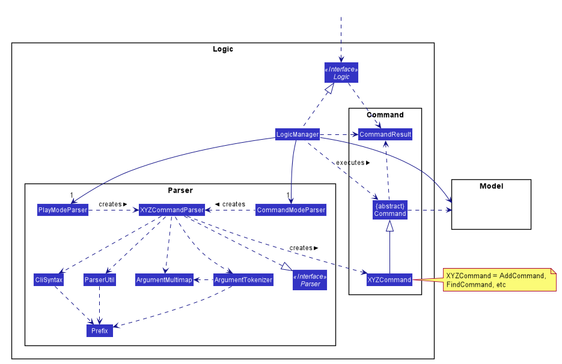</span>
<div align="center"><sup style="font-size:100%"><i>Figure 2. Example Class Diagram of the Logic Component</i></sup></div><br>


### 3.2 Architecture Sequence Overview

Each of the components interact with one another when the user issues a command. Most, if not all commands utilize `UI`,
`Logic` and `Model` components. `Storage` is utilized depending on whether the command requires data to be stored for
future references.

The _Sequence Diagram_ below (Figure 3) shows how the components interact with one another when the user issues the command `remove 1`.

<span style="display:block;align:center">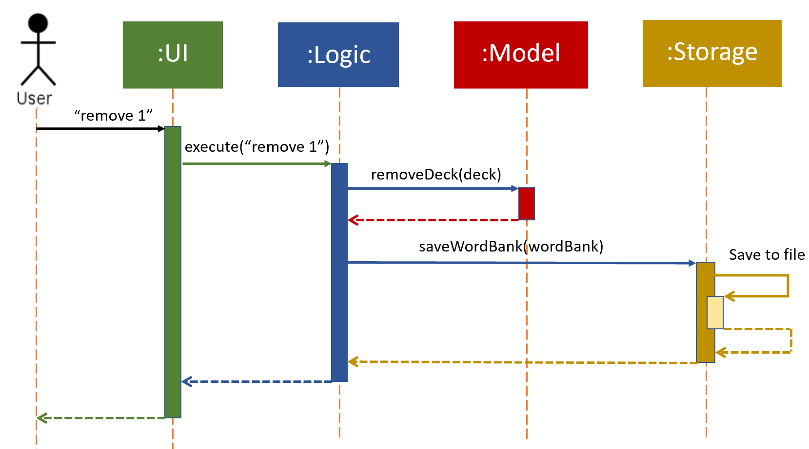</span>
<div align="center"><sup style="font-size:100%"><i>Figure 3. Sequence Diagram of Various Components</i></sup></div><br>

The sections below give more details about each component.

### 3.3 Common classes

Common classes are classes used by multiple components.
They can be found in the `seedu.addressbook.commons` package.

Common classes include:

- `Index`: Represents a zero or one based index. Using `Index` removes the need for a component to know what base other
  components are using for their index. Can be converted to an integer (int).
- `Messages`: Stores messages to be displayed to the user.
- `GuiSettings`: Contains the GUI settings.
- `LogsCenter`: Writes messages to the console and a log file. Records the state of the program as the app is running.

### 3.4 UI component

The `UI` component is the portion of the application which is visible to the user.
The `UI` consists of a `MainWindow` that is made up of various parts (E.g `CommandBox`, `ResultDisplay`, `DeckListPanel`, `StatusBarFooter`)
All these, including the `MainWindow`, inherit from the abstract `UiPart` class.

The structure diagram of the `UI` component is shown below in Figure 4.

<span style="display:block;align:center">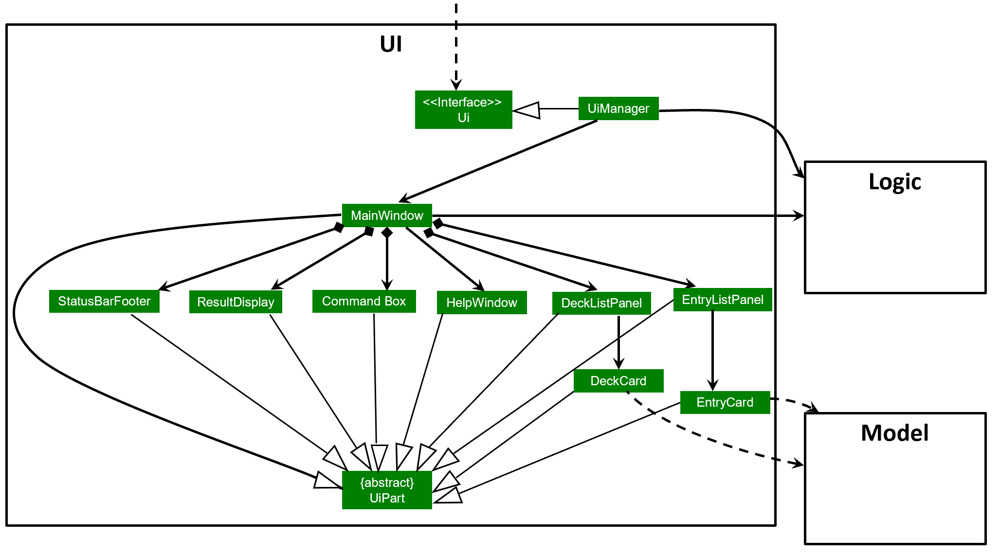</span>
<div align="center"><sup style="font-size:100%"><i>Figure 4. UI component class relationship diagram</i></sup></div><br>

**API** :
[`Ui.java`](https://github.com/AY2021S1-CS2103T-T09-4/tp/blob/master/src/main/java/seedu/address/ui/Ui.java)

Role of the `Ui` component:

- Receives the user input.
- Executes user commands using the `Logic` component.
- Listens for changes to `Model` data so that the `Ui` can be updated with the modified data.

The `Ui` component uses the JavaFx UI framework. The layout of these UI parts are defined in matching `.fxml` files that are in the `src/main/resources/view` folder.

For example, the layout of the [`MainWindow`](https://github.com/AY2021S1-CS2103T-T09-4/tp/blob/master/src/main/java/seedu/address/ui/MainWindow.java) is specified in [`MainWindow.fxml`](https://github.com/AY2021S1-CS2103T-T09-4/tp/blob/master/src/main/resources/view/MainWindow.fxml)

`MainWindow.fxml` - Houses the rest of the fxml (commandBox,HelpWindow, etc) in the VBox. Contains the code for the actual menu bar

`CommandBox.fxml` - Takes in the user input and passes it to `MainWindow` which will pass the input to `Logic`

`DeckListPanel.fxml` - Houses a ListView<Deck>

`EntryListPanel.fxml` - Houses a ListView<Entry>

`EntryListCard.fxml`- Contains the word and translation data of each entry. Note that it is not housed by MainWindow.fxml

`QuizPanel.fxml` - Displays quiz information to the user

`ScorePanel.fxml` - Displays quiz score to the user only after a quiz has ended

`StartPanel.fxml` - Displays green tea icon and some sample commands to the user

`StatisticsPanel.fxml` - Displays the statistics of past quizzes to the user

`HelpWindow.fxml` - Displays label and copy url button

`ResultDisplay.fxml` - Prints results to user

`StatusBarFooter.fxml` - Returns the path of the file retrieved

:information_source: **Note:**

`MainWindow.fxml` contains a **tabPanel** which switches between 4 panels depending on the command given by the user.
Commands update a class called `CurrentView.java` in `Model`. Based on the current view, the tab panel will be updated accordingly

- Panel which shows upon _starting the application_ is `StartPanel.fxml`.
- Panel which shows upon _selecting a deck_ is `EntryListPanel.fxml`.
- Panel which shows upon _starting a quiz game_ is `QuizPanel.fxml`.
- Panel which shows upon _giving stats command_ is `StatisticsPanel.fxml`.

### 3.5 Logic component

The `Logic` component is the bridge between the `UI` and `Model` components. It is in charge of deciding what to do with the
user input received from the `UI`. This component consists of the `Statistics`, `Parser` and the `Command` package.

The class diagram of the `Logic` component is shown below in Figure 5.

<span style="display:block;align:center"></span>
<div align="center"><sup style="font-size:100%"><i>Figure 5. Logic Component Class Diagram</i></sup></div><br>

**API** :
[`Logic.java`](https://github.com/AY2021S1-CS2103T-T09-4/tp/blob/master/src/main/java/seedu/address/logic/Logic.java)

Role of the `Logic` component:

- Receives the user command.
- `Logic Manager` can either be in Play Mode or in Command Mode.
- Uses the `PlayModeParser` or the `CommandModeParser` class to parse the user command depending on the mode it is in.
- Creates a `Command` object which is passed and executed by `LogicManager`.
- Executing the command can affect the `Model` (e.g. adding a deck).
- Returns the result of the command execution as a `CommandResult` object which is passed back to the `Ui`.
- Initialises the `StatisticsManager` on startup via `LogicManager` and maintains the `Statistics`.
- In addition, the `CommandResult` object can also instruct the `Ui` to perform certain actions, such as displaying help to the user.

Role of the `Parser` package:

- Derives the command word and the arguments of the user input
- Throws a `ParserException` if the command word or argument are not correctly written

Role of the `Statistics` package:

- More explained under [Implementations - Statistics](#43-statistics)

Role of the `Command` package:

- Contains the various command classes
- Throws a `CommandException` if an error occurs between execution and obtaining `CommandResult`

Given below is the Sequence Diagram for interactions within the `Logic` component for the `execute("remove 1")` API call.

<span style="display:block;align:center"></span>
<div align="center"><sup style="font-size:100%"><i>Figure 6. Sequence Diagram of Logic Component for "Remove 1" Command</i></sup></div><br>

### 3.6 Model component

The `Model` component is in charge of changing the data within the application.
This includes information about decks, entries and statistics.
The `Model` component consists of the `Play`, `Deck` and `View` package.
- The `Play` package consists of the `Scoring` package,`Leitner` object and the `Score` object.
- The `Deck` package consists of the `Entry` package, the `Deck` object and
all other similar object.
- The `View` package consists of a `CurrentView` class.

All these information on the `Model` component is visually expressed in the class diagram below.

<span style="display:block;align:center">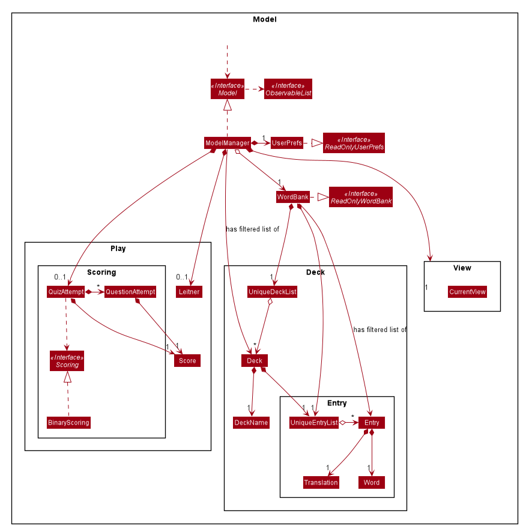</span>
<div align="center"><sup style="font-size:100%"><i>Figure 7. Model Component Class Diagram</i></sup></div><br>


**API** : [`Model.java`](https://github.com/AY2021S1-CS2103T-T09-4/tp/blob/master/src/main/java/seedu/address/model/Model.java)

Role of `Model` component:

- Stores a `UserPref` object that represents the user’s preferences.

- Stores a `CurrentView` object that represents the current tab view on the UI.
- Stores a `WordBank` component that maintains all the current `Entry` and `Deck` data.
- Stores a `FilteredList<Deck>` object that maintains the current list of `Deck` in memory for error checking purposes.
- Creates and maintains a `Leitner` object and a `QuizAttempt` object using a selected deck from `FilteredList<Deck>` if
  a `PlayCommand` object is executed by `Logic`.

Role of `WordBank` component

- Maintains all the current `Entry` and `Deck` data.
- Stores a `FilteredList<Entry>` object that maintains the current list of `Entry` in memory.
- Exposes an unmodifiable `ObservableList<Deck>` and `ObservableList<Entry>`
  that can be 'observed'. E.g. the UI can be bound to this list so that the UI automatically updates when the data in the list change.

Role of `Leitner` object:

- More explained under [Implementations - Leitner and QuizAttempt](#425-leitner-and-quizattempt)

Role of `QuizAttempt` object:

- Maintains the list of current `Score` and `QuestionAttempt` of the quiz.
- More explained under [Implementations - Leitner and QuizAttempt](#425-leitner-and-quizattempt)

Role of `scoring` component

- Computes the score of the user during a quiz, depending on how similar the given answer is to the actual answer


### 3.7 Storage component

The `Storage` component handles the reading and writing of data from a data file. By storing the data,
the application will be able to load the data from the previous session back to the user when the user opens
the application.
The class diagram of the `Storage` component is shown below.

<span style="display:block;align:center">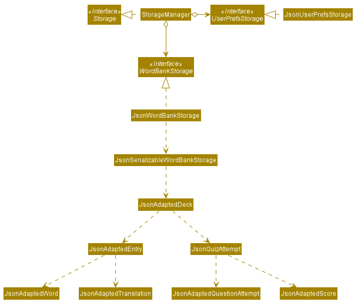</span>
<div align="center"><sup style="font-size:100%"><i>Figure 8. Storage Component Class Diagram</i></sup></div><br>


**API** : [`Storage.java`](https://github.com/AY2021S1-CS2103T-T09-4/tp/blob/master/src/main/java/seedu/address/storage/Storage.java)

The `Storage` component,

- Saves`UserPref` objects in json format and read it back.
- Saves the word bank data (mainly Decks and QuizAttempts) in json format and read it back

From Figure 8, it can be observed that `JsonSerializableWordBankStorage` consists of a list of `JsonAdaptedDeck` objects.

`JsonSerializableWordBankStorage` can be then serialized in order to convert data from json files into Green Tea's model.
Data from Green Tea's model can also be converted into json files through the reverse of this process.

`StorageManager` manages the process of saving and reading data

All the data is eventually stored in `wordbank.json` in the `data` folder. When the application is restarted,
the data from `wordbank.json` is read and converted into Green Tea's model.

:information_source: **Note:** An alternative (arguably, a more OOP) model is given below in Figure 9.
In this model, the `Deck` and `Entry` data is separated from the `QuizAttempt` data.
This allows for better management of data and for example could allow users to share `Deck` data with other users without sharing their `QuizData`.

<span style="display:block;align:center">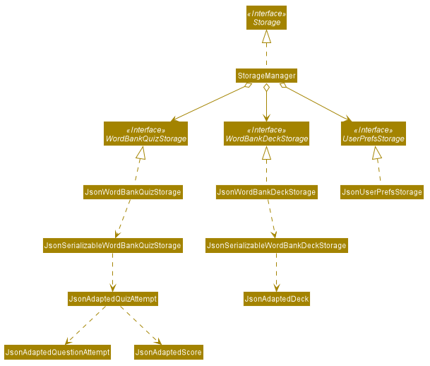</span>
<div align="center"><sup style="font-size:100%"><i>Figure 9. More OOP Storage Class Diagram</i></sup></div><br>

---

## 4. Implementation

This section describes some noteworthy details on how and why certain features are implemented.

### 4.1 Deck Feature

#### 4.1.1 Overview

This feature allows the user to create multiple lists of entries called decks.

The user can have different decks for different languages or multiple decks for the same language.

E.g.

- Deck 1: Japanese
- Deck 2: Spanish Food
- Deck 3: Spanish Animals

Users will be able to `add` decks, `delete` decks and `select` decks.

##### Design Considerations

###### Aspect: One long list of entries or deck system

- **Alternative 1 (current choice)**: Deck system

  - Pros: Users are better able to organize their entries into groups.
    Commands such as `find` and `list` to filter entries are no longer needed.
    Allows [flashcard system](#42-flashcard-system) to be implemented more easily.
    Higher level of abstraction.
  - Cons: Harder to implement, more code and commands required

- **Alternative 2**: One long list of entries
  - Pros: Easier implementation, less code required.
  - Cons: Harder for users to navigate and find the entry that they are looking for.


#### 4.1.2 Commands Implemented

Three commands are used in order to support having a deck system - New Deck Command, Remove Deck Command and Select Deck Command.

- `new <DECK>` - Adds a new deck to the word bank.
- `remove <INDEX>` - Removes the deck at the specified index.
- `select <INDEX>` - Selects the deck at the specified index.

Each of these three commands require the use of the `UI`, `Logic` and `Model` components.

For example, when a deck is added:
- The `Logic` must execute the command.
- The `Model` must be updated with a new deck list containing the added deck.
- The`UI` must also reflect the added deck to be shown to the user.
- The `Storage` component is needed for commands `new` and `remove`.

#### 4.1.3 Select Deck

This feature requires the user to select a deck (using `select <INDEX>`) in order to change the contents of the deck.

Only after selecting a deck, can some other commands (E.g `add`, `delete`, `edit`, `/play`) be performed.


:information_source: **Note:** The implementation of this feature requires the GUI to be updated whenever a deck is selected. This is done by using the
UI, Logic and Model components.

- The selected deck is retrieved from `FilteredList<Deck>` in the model component.
- These entries in the selected deck replaces the current entries in the `UniqueEntryList` object of WordBank causing the GUI to change accordingly.
- This approach is used for other commands that changes the GUI such as `add <entry>` and `clear` command


The figure below is an activity diagram that provides the behavior of the system when the user gives a `SelectDeckCommand`.

<span style="display:block;align:center">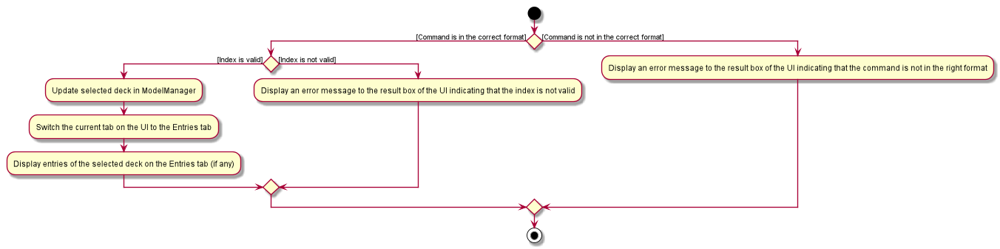</span>
<div align="center"><sup style="font-size:100%"><i>Figure 10. Select Deck Command Activity Diagram</i></sup></div><br>

There are two criteria to be met in order for a `SelectDeckCommand` to be successfully executed.

- The command format must be correct (`select <INDEX>`)
- The index given must be valid. A valid index is a positive integer that not larger than the current deck list size.

When these two criteria are met,

- The field `currentDeckIndex` in `ModelManager` will be updated to the selected deck index.
- The UI will change tabs to the entries tab (if it was not already on entries tab). This is done by changing the `currentView`
  in `ModelManager` to `View.ENTRY_VIEW`.
- The UI will display the entries of the selected deck to the user


##### Design Considerations

###### Aspect: Command format to select a deck

- **Alternative 1 (current choice)**: `select <DECK_INDEX>` Select a deck before any entry level command can be given.
  E.g. `select 1` followed by `delete 1`

  - Pros: Easier for a user to make continuous changes to the same deck.
    Allows following features to be implemented more easily.
  - Cons: Users have to give an additional command.

- **Alternative 2**: `delete <DECK_INDEX> <ENTRY_INDEX>` Entry level commands specify a deck. E.g `delete 1 1`
  - Pros: Single command for users to execute
  - Cons: May cause confusion to the users.

Utimately, we decided that user navigability was more important than the extra `select` command needed. This is because
Green Tea is designed to be a simple and easy system for new users to use.


#### 4.1.4 Entry Level Commands

Due to the design decisions for the [select deck command](#413-select-deck), all entry level commands such as
`add`, `delete`, `edit` and `/play` can only be performed after a deck is selected.

The diagrams below illustrate the steps taken in order to successfully execute an `AddCommand`.

First, a deck has to be selected.

Given below is the sequence diagram for `SelectDeckCommand`

<span style="display:block;align:center">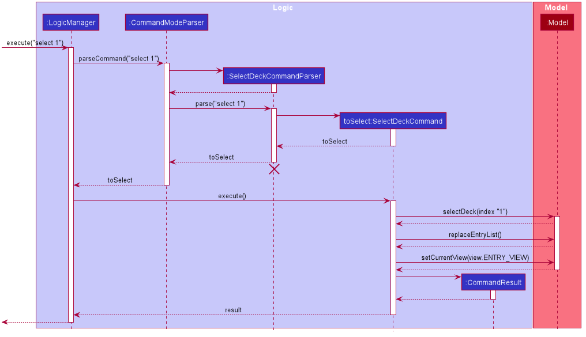</span>
<div align="center"><sup style="font-size:100%"><i>Figure 11. Select Deck Command Sequence Diagram</i></sup></div><br>

From the diagram above, entering `select 1` will result in the following steps:

Step 1: User enters `select 1`

Step 2: The user input is saved as a `String` and passed into `LogicManager`

Step 3: `LogicManager` passes the `String` to `CommandModeParser`

Step 4: A `SelectDeckCommandParser` is created

Step 5: The `String` is passed from `CommandModeParser` to `SelectDeckCommandParser` to parse

Step 6: `SelectDeckCommandParser` creates a new `SelectDeckCommand` object stored as a variable `toSelect`

Step 7: `toSelect` is then passed back to `LogicManager` via `SelectDeckCommandParser` and `CommandModeParser`.

Step 8: `LogicManager` executes the `toSelect` command

Step 9: The `toSelect` command invokes `selectDeck(Index index)` method in `Model`

Step 10: The `toSelect` command then invokes `replaceEntryList()` method in `Model` update the entry list to that of the selected deck

Step 11: The `toSelect` command also invokes `setCurrentView(View view)` method in `Model` to set the current view to `ENTRY_VIEW`

Step 12: A `CommandResult` object is created and returned to `LogicManager`. The `CommandResult` displays the command success
message to the user via the GUI to signify the end of the command execution.


Now that a `SelectDeckCommand` has been sucessfully executed, the `AddCommand` can be executed.

Given below is the activity diagram for an `AddCommand`.

<span style="display:block;align:center">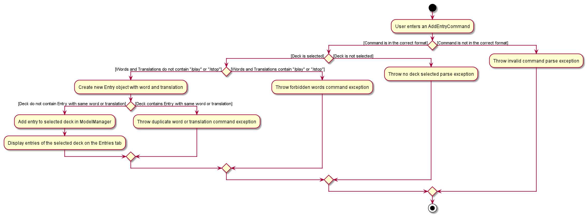</span>
<div align="center"><sup style="font-size:100%"><i>Figure 12. Add Command Activity Diagram</i></sup></div><br>

There are four criteria to be met in order for an `AddCommand` to be successfully carried out.

- First, the command format must be correct. (`add w/<WORD> t/<TRANSLATION>`)
- Second, a deck must be selected. (_see figure 11_)
- Third, reserve words like `/play` and `/stop` cannot be added into the word bank.
- Fourth, the word-translation pair cannot already exist in the word bank. (_Word-translation pairs are considered to be
the same if they have the exact same translation_)

When these criteria are met,

- The entry with the word-translation pair will be added to the selected deck in `ModelManager`.
- The GUI will update to show the new entry in the entry list.


### 4.2 Flashcard System

#### 4.2.1 Overview

The `Flashcard System` is a feature that allows the user to quiz themselves on a selected deck's entries.
The user can quiz themselves after ensuring a deck is already selected using a `SelectCommand` and then
invoking a `PlayCommand`. This feature will also keep track and update the score of the quiz.

This section will explain:

- How the application separates the play mode commands from the command mode commands.
- How the play mode commands work.
- How scoring is calculated and saved in `Storage` based on each quiz.


##### Design Considerations:

###### Aspect: Type of flashcard system

- **Alternative 1 (current choice)** : Leitner System
  - Pros: The Letiner system is a proven quizzing system that increases the user's rate of learning by
    using spaced repetition. Questions are sorted based on the user's ability to answer them. Correctly
    answered questions are put at the end of the question queue and incorrectly answered
    questions are placed at the front.
  - Cons: More difficult to implement
- **Alternative 2** : Random shuffling system
  - Pros: Easier to implement
  - Cons: Users may not learn as effectively

#### 4.2.2 Commands Implemented

The `SelectCommand` follows the format: `select <index>`.

The `PlayCommand` follows the format: `/play`.

Three commands are used in order to support the Flashcard system - PlayCommand, StopCommand and AnswerCommand

- `/play` - Starts a new Flashcard game / quiz.
- `/stop` - Stops the current Flashcard game/ quiz.
- `[Any Answer]` - Answers the current question in the Flashcard game / quiz. This input does not have a specific structure or command.

Each of these three commands require the use of the `UI`, `Logic` and `Model` components.
For example, when a deck is played, the `model` must be updated with a shuffled deck containing the shuffled entries.

#### 4.2.3 Play Mode and Command Mode

The `Logic` component is responsible for receiving, parsing and executing the user command. In addition to this,
the `Logic Manager` maintains a private `boolean` field known as `isPlayMode` that is originally set to `false`.

If `isPlayMode` is set to `true`, `Logic Manager` will be in Play Mode and will parse all incoming input through the `PlayModeParser`.

If `isPlayMode` is set to `false`, `Logic Manager` will be in Command Mode and will parse all incoming input through the `CommandModeParser`.

:information_source: **Note:** In Play Mode, all commands are treated as valid unless the command word is `/play`.

The figure below is an activity diagram that provides a generalized overview on the behavior of `Logic Manager` when a user
enters any command.

<span style="display:block;align:center">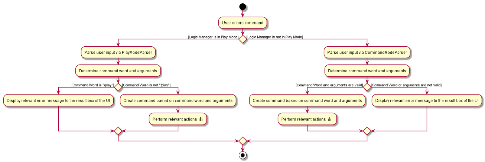</span>
<div align="center"><sup style="font-size:100%"><i>Figure 13. Generalized Command Activity Diagram</i></sup></div><br>

The left rake symbol in the above figure can refer to any Play Mode command such as [the answer command](#424-answer-command-and-stop-command) (besides the `PlayCommand`)
while the right rake symbol can refer to any Command Mode command such as [the select command](#413-select-deck)

To switch `Logic Manager` into Play Mode, the user can enter a `PlayCommand`. Below is a sequence diagram for the `PlayCommand`.

<span style="display:block;align:center">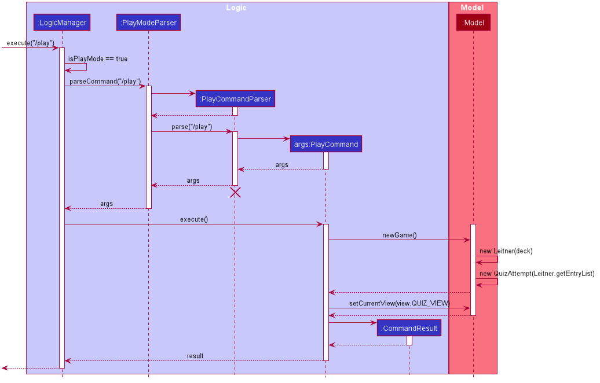</span>
<div align="center"><sup style="font-size:100%"><i>Figure 14. Play Command Sequence Diagram</i></sup></div><br>

From the above diagram, entering `/play` will result in the follow steps:

Step 1: User enters `/play`

Step 2. The input is saved as a `String` and passed into `Logic Manager`.

Step 3. The boolean field `isPlayMode` in `Logic Manager` becomes `true`.

Step 4. `Logic Manager` passes the `String` to `PlayModeParser`

Step 5. A `PlayCommandParser` is created.

Step 6. The `String` is passed from `PlayModeParser` to `PlayCommandParser` to parse.

Step 7. `PlayCommandParser` creates a new `PlayCommand` object stored as a variable `args`.

Step 8. `args` is then passed back to `Logic Manager` via `PlayCommandParser` and `PlayModeParser`. `PlayCommandParser`
is then deleted.

Step 9. `Logic Manager` executes the `args` command.

Step 10. The `args` command invokes `newGame()` in `Model`.

Step 11. `Model` creates a new [`Leitner` object and `QuizAttempt` object](#425-leitner-and-quizattempt)

Step 12. The `args` command also invokes the `Model` object to set the current view  to `QUIZ_VIEW`.

Step 13. A `CommandResult` object is created and returned to `Logic Manager` to signify the end of the command execution.
The `CommandResult` displays the command success message to the user via the GUI to signify the end of the command execution.

The activity diagram below summarizes the high level behavior of `LogicManager` and `Model` when the user enters a `PlayCommand`.
<span style="display:block;align:center">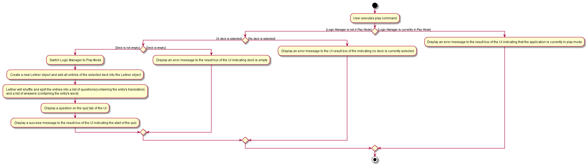</span>
<div align="center"><sup style="font-size:100%"><i>Figure 15. Play Command Activity Diagram</i></sup></div><br>

#### 4.2.4 Answer Command and Stop Command

When in Play Mode, `Logic Manager` will only handle two commands. They are the `StopCommand` and the `AnswerCommand`.
In this implementation, all inputs that do not match the format for the `StopCommand` are treated as inputs
to the `AnswerCommand`.

Below is the corresponding sequence diagram for the 'AnswerCommand'.

<span style="display:block;align:center">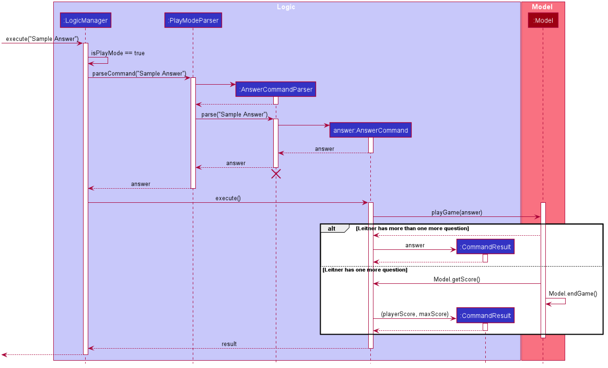</span>
<div align="center"><sup style="font-size:100%"><i>Figure 16. Answer Command Sequence Diagram</i></sup></div><br>

From the above diagram, entering an answer in Play Mode will result in the follow steps:

Step 1: User enters `Sample Answer`

Step 2. The input is saved as a `String` and passed into `Logic Manager`.

Step 3. `Logic Manager` passes the `String` to `PlayModeParser`

Step 4. A `AnswerCommandParser` is created.

Step 5. The `String` is passed from `PlayModeParser` to `AnswerCommandParser` for parsing.

Step 6. `AnswerCommandParser` creates a new `AnswerCommand` object stored as a variable `answer`.

Step 7. `answer` is then pass back to `Logic Manager` via `AnswerCommandParser` and `PlayModeParser`.
`AnswerCommandParser` is then deleted.

Step 8. `Logic Manager` executes the `answer` command.

Step 9. The `answer` command invokes `playGame(answer)` in `Model`.

Step 10. Depending on the correctness of the `answer`, Model will update the score via `updateScore()`.

Step 11a. If the [`Leitner` object](#425-leitner-and-quizattempt) stored in `Model` has more than one question left, `Model`
will update the next question via `updateQuestion()`.
A `CommandResult` object is created storing the `answer` and returned to `Logic Manager` to signify the end of the command execution.
The `CommandResult` displays the answer details to the user via the GUI to signify the end of the command execution.

Step 11b. Else, the current question is the final question that is answered in the quiz.
A `CommandResult` object is created and returned to `Logic Manager` storing the `playerScore` and the `maxScore` of the quiz as `Strings`.
The `CommandResult` displays the score to the user via the GUI to signify the end of the command execution.


The two figures below are the activity diagram that describes the high level behavior of `LogicManager` and `Model` when the user
enters a answer in Play Mode.

:information_source: **Note:** Both figures are connected by the rake symbol in Figure 17.

:information_source: **Note:** Figure 17 mainly capture the states of the `StopCommand` while Figure 18
captures the states of the `AnswerCommand`.

<span style="display:block;align:center">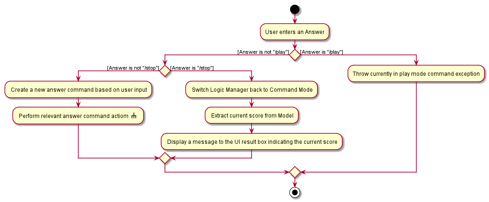</span>
<div align="center"><sup style="font-size:100%"><i>Figure 17. Answer Command Activity Diagram One</i></sup></div><br>

<span style="display:block;align:center">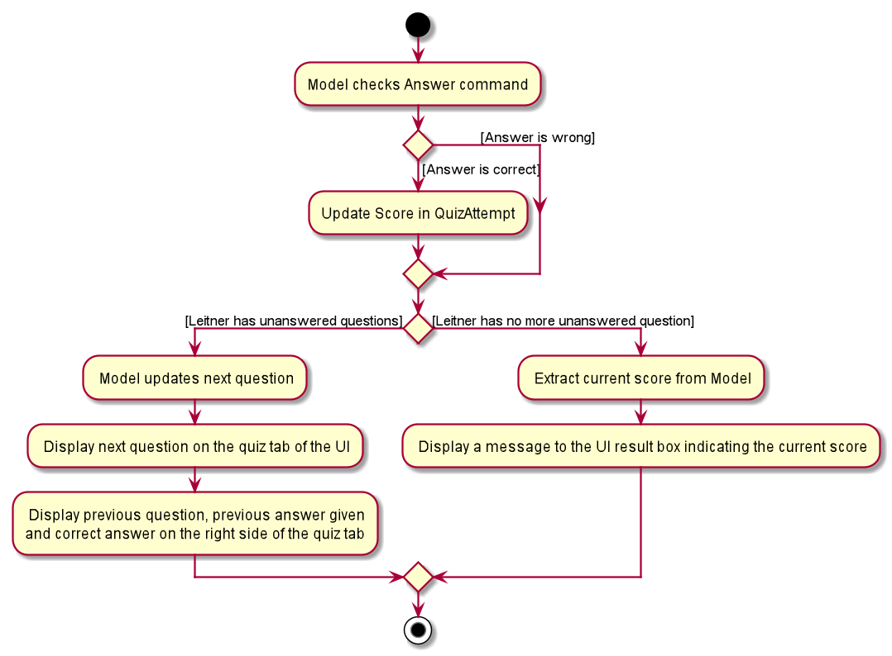</span>
<div align="center"><sup style="font-size:100%"><i>Figure 18. Answer Command Activity Diagram Two</i></sup></div><br>

#### 4.2.5 Leitner and QuizAttempt

The Leitner system is a system to randomize the questions presented to a user based on their most recent past attempt of the quiz if any, otherwise random shuffle is executed.
`Leitner` is a class that encapsulates this algorithm. It is constructed with `Deck` as the only parameter and stores the next question list to be presented to the player in its internal `entryList` object, retrieved via `leitner.getEntries()`.

How it works is as follows (this is in `ModelManager`):

```java
// construct the Leitner object, passing in the deck
Leitner leitner = new Leitner(deck);

// shuffle and store results of shuffle in leitner's internal entryList
leitner.doTheLeitner();

// get the entries (questions) to show the player
// the order of the questions in the entry follows that of the Leitner system described above
Entry entries = leitner.getEntries();
```

Later, a series of `leitner.addGuess(guess)` is called until the end of the quiz to reflect "answering a question". Leitner will create a new `QuestionAttempt` for each of these guesses and store all the `QuestionAttempt`s in a list. This list of `QuestionAttempt` is stored in a `QuizAttempt` in the `Deck` and is used in generating the next order of questions to show the user.

### 4.3 Statistics

#### 4.3.1 Overview

We track quiz-specific and app-wide data. Quiz-specific data refers to data that reflects the complete attempt/playthrough of a particular quiz which we call a `QuizAttempt`. In particular, `QuizAttempt` is a list of `QuestionAttempt`s, where each `QuestionAttempt` consists of the user's answer, the correct answer, and the total score received for that question out of `1.0`.

App-wide data on the other hand refers events like logins and logouts, time last logged in, average time spent on app, number of quizzes taken in total, etc. We disembarked working on this feature in favor of other features such as Leitner as we found it to not value-add to the user that much. Nonetheless, we decided to include it as it might be interesting from an engineering standpoint.

#### 4.3.2 QuizAttempt and QuestionAttempt

Each `Deck` consists of a list of `QuizAttempt`s. Each `QuizAttempt` object encapsulates a given entire playthrough of the `Deck`.

It contains:

- list of `QuestionAttempt`s
- duration of the quiz
- time the quiz was taken at
- total score
- and `Scoring`

Apart from `Scoring`, the rest of the attributes are computed on the fly as a new `QuestionAttempt` is added to the `QuizAttempt`. `Scoring` is just an interface that has an abstract method `computeScore` which takes in two strings and returns a `double` between `0.0` and `1.0`, depending on how it is implemented e.g. `BinaryScoring` will give `1.0` if the strings are same, and `0.0` if not; `EditDistanceScoring` will score based on the edit distance between the two strings.

As a new `QuestionAttempt` is added, `Scoring` will compute the score for that question based on the answer the user gave and the correct answer.

To make `Deck` as cohesive as possible, a `Deck` consist of a list of `QuizAttempt`. This way, when `Deck` is persisted to disk, we also persist the list of `QuizAttempt` for that deck together with it. Also, `QuizAttempt` is only ever used together with `Deck` so it made sense to store list of `QuizAttempt`s as an attribute of `Deck`.

#### 4.3.3 Statistics Manager

`StatisticsManager` singleton class to encapsulate all app-related event logs. Whenever the `StatisticsManager` class is created, a `LOGIN` event is appended to its internal event log. Whenever `cleanup()` is called on `StatisticsManager`, a `LOGOUT` event is called. Each event also has an associated timestamp. Through the log of events, statistics like average time spent on app, last login time, etc can be computed on demand.

An instance of `StatisticsManager` is instantiated in the constructor of `LogicManager` and destroyed when `cleanup()` is called on `LogicManager`. It makes the most sense to call these lifecycle operations in these parts of `LogicManager` as they parallel the opening and closing lifecycle of the app.

---

## 5. Documentation, logging, testing, configuration, dev-ops

- [Documentation guide](Documentation.md)
- [Testing guide](Testing.md)
- [Logging guide](Logging.md)
- [Configuration guide](Configuration.md)
- [DevOps guide](DevOps.md)

---

## 6. Appendix: Requirements

### 6.1 Product scope

**Target user profile**:

A person that:

- wants to learn and practice a language
- wants to remember the meaning and spelling of words in a new language
- prefers question based testing to learn a language
- prefer desktop apps over other types of apps
- is able to type fast
- prefers typing to using a mouse
- is reasonably comfortable using CLI apps

**Value proposition**: helps users learn a language better through a flashcard system and allows users to track their
leaning progress

### 6.2 User stories

Priorities: High (must have) - `* * *`, Medium (nice to have) - `* *`, Low (unlikely to have) - `*`

| Priority | As a …​  | I want to …​                              | So that I can…​                                                |
| -------- | -------- | ----------------------------------------- | -------------------------------------------------------------- |
| `* * *`  | new user | see usage instructions                    | refer to instructions when I forget how to use the application |
| `* * *`  | user     | add a Word-Translation pair               | so that I can populate the list with entries            |
| `* * *`  | user     | delete a Word-Translation pair            | delete an unwanted entry                                       |
| `* * *`  | user     | edit a Word-Translation pair              | edit an entry                                                  |
| `* * *`  | user     | access a Dictionary of Word-Translation pairs | refresh my understanding of the words                      |
| `* * *`  | user     | create a question                         | test my understanding of a word                                |
| `* * *`  | user     | create an open-ended question             | test my spelling and understanding of the word                 |
| `* * *`  | user     | delete a question                         | delete an unwanted test question                               |
| `* * *`  | user     | edit a question                           | edit a question                                                |
| `* * *`  | user     | access the list of questions              | view all the questions                                         |
| `* * *`  | user     | create a quiz from the pool of questions  | attempt the questions                                          |
| `* * *`  | user     | submit the quiz                           | see my results                                                 |
| `* *`    | user     | view statistics of the quiz               | gauge my strengths and weaknesses                              |
| `* *`    | user     | view past quiz scores                     | know how I performed for each quiz                             |
| `*`      | user     | test my spelling                          | learn how to spell the words correctly                         |

### 6.3 Use cases

(For all use cases below, the **System** is `Green Tea` and the **Actor** is the `user`, unless specified otherwise)

**Use case 1: View help**

**MSS**

1.  User requests help
2.  Green Tea returns a message explaining how to access the help page with the link to the Official UserGuide

    Use case ends.

**Use case 2: Add a new entry**

**MSS**

1.  User requests to add a new entry
2.  Green Tea add the new entry

    Use case ends.

**Extensions**

- 1a. The entry is invalid

  - 1a1. Green Tea shows an error message

  Use case ends.

- 1b. The entry is valid.

  Use case resumes at step 2.

**Use case 3: Exit application**

**MSS**

1.  User requests to exit program
2.  Green Tea exits

    Use case ends.

**Use case 4: Edit an entry**

**MSS**

1.  User requests to edit an entry with updated fields via the given index
2.  Green Tea updates entry with new fields

    Use case ends.

**Extensions**

- 1a. User gives an invalid index

  - 1a1. Green Tea returns an error message

  Use case ends.

**Use case 5: Delete an entry**

**MSS**

1.  User requests to delete a specific entry in the list via the given index
2.  Green Tea deletes the entry

    Use case ends.

**Extensions**

- 1a. The given input does not match the format

  - 1a1. Green Tea shows an error message

    Use case resumes at step 2.

- 1b. The given index is invalid.

  - 1b1. Green Tea shows an error message.

    Use case resumes at step 2.

**Use case 6: Clear decks**

**MSS**

1.  User requests to clear decks
2.  Green Tea clears all decks

    Use case ends.

**Use case 7: Play a Quiz**

**MSS**

1. User requests to play a quiz for a particular deck
2. Green Tea starts the quiz
3. User answers each question and completes the quiz
4. Green Tea provides the score and results of the quiz, and saves the results

    Use case ends.

**Use case 8: Stop a Quiz**

**MSS**

1. User requests to play a quiz for a particular deck
2. Green Tea starts the quiz
3. User stops the quiz
4. Green Tea stops the quiz and does not save the results

    Use case ends.

**Use case 9: View Statistics**

**MSS**

1. User requests to view statistics of quizzes played so far for a particular deck, or across all decks
2. Green Tea displays the statistics accordingly

    Use case ends.

**Extensions**

- 1a. The given index is invalid.

  - 1a1. Green Tea shows an error message.

    Use case resumes at step 1.


### 6.4 Non-Functional Requirements

1.  Green Tea should work on any _mainstream OS_ as long as it has Java `11` or above installed.
2.  Green Tea should be able to hold up to 1000 entries in a deck without a noticeable sluggishness in performance for typical usage.
3.  A user with above average typing speed for regular English text (i.e. not code, not system admin commands)
    should be able to accomplish most of the tasks faster using commands than using the mouse.
4.  Green Tea should have a user interface that is intuitive enough for new users to navigate easily.
5.  Any interface between a user and the system should have a maximum response time of 2 seconds.
6.  Green Tea should be free to download and use.
7.  Green Tea should be able to function without internet connection.
8.  Any reused code should be acknowledged in the README.

### 6.5 Glossary

- **Deck**: A collection of entries
- **Entry**: A word and its translation
- **Mainstream OS**: Windows, Linux, Unix, OS-X
- **Private contact detail**: A contact detail that is not meant to be shared with others
- **Word bank**: A collection of decks

---

## 7. Appendix: Instructions for manual testing

Given below are instructions to test the app manually.

:information_source: **Note:** These instructions only provide a starting point for testers to work on;
testers are expected to do more *exploratory* testing to understand the app better.


### 7.1 Launch and shutdown

Initial launch

Prerequisites: Have Green Tea.jar downloaded and copied into an empty folder

1. Double-click the jar file.<br>
   Expected: Shows the GUI with a set of sample decks. The window size may not be optimum.

Saving window preferences

1. Resize the window to an optimum size. Move the window to a different location. Close the window.

2. Re-launch the app by double-clicking the jar file.<br>
   Expected: The most recent window size and location is retained.

### 7.2 Getting Help

Displays a guide for all commands.

Prerequisites: Launch Green Tea succesfully.

1. Test case: `help`<br>
   Expected: A help window pops up and provides a link to the Official UserGuide

### 7.3 Creating a Deck
Creating a deck while all decks are displayed

Prerequisites: Launch Green Tea successfully

1. Test Case: `new Japanese Animals`<br>
    Expected: an empty Deck named Japanese Animals created and displayed in the DeckList panel. Status message to say "New deck added: Japanese Animals"

2. Other incorrect commands:
    - `new` without providing the name of the deck
    - `Japanese Animals` without providing the key word `new`

### 7.4 Removing a deck

Removing a deck while all decks are displayed

Prerequisites: Multiple decks in the list.

1.  Test case: `remove 1`<br>
    Expected: First deck is removed from the list. Status message shown to confirm that the deck has been deleted.

2.  Test case: `select 1` then `remove 1`<br>
    Expected: First deck is removed from the list. Status message shown to confirm that the deck has been deleted.
    The tab panel, previously showing the entries of deck 1, will show the start panel.

3.  Test case: `remove 0`<br>
    Expected: No deck is removed. Error details shown in the status message.

4.  Other incorrect remove commands to try:
    - `remove` without providing index
    - `remove asdf` providing an invalid index
    - `remove x` (where x is a positive integer larger than the list size)<br>
      Expected: Similar to previous test case 4

### 7.5 Creating an Entry
Creating an entry in a selected deck

Prerequisites: Have a deck present

1. Test Case: `select 1` and then `add w/Hola t/Hello`<br>
    Expected: An entry (Hola, Hello) would be added to Deck 1, displayed in the Entries panel. Status message to say "New entry added: hola Translation: hello"

2. Other incorrect commands to try:
    - `add w/Hola t/Hello` without selecting a deck before
    - `select 1` and then `add w/Hola` without providing its word
    - `select 1` and then `t/Hello` without providing its translation

### 7.6 Editing an Entry
Editing an existing entry in a particular deck

Prerequisites: Have a deck with entries present

1. Test Case: `select 1` and then `edit 2 t/hello there`<br>
   Expected: Entry 2 in Deck 1 will have its translation edited to "hello there", and will be reflected in the entries panel.
   Status message to say "Edited Entry: hola Translation: hello there"

2. Test Case: `select 1` and then `edit 2 w/hola amigos`<br>
   Expected: Entry 2 in Deck 1 will have its word edited to "hola amigos", and will be reflected in the entries panel.
   Status message to say "Edited Entry: hola amigos Translation: hello there"

 3. Test Case: `select 1` and then `edit 2 w/hola amigos t/hello friends`<br>
   Expected: Entry 2 in Deck 1 will have its word and translation edited to "hola amigos" and "hello friends" respectively,
   and will be reflected in the entries panel.
   Status message to say "Edited Entry: hola amigos Translation: hello friends"

 4. Other incorrect commands to try:
    - `edit 2 t/hello there` without selecting a deck first
    - `select 1` and then `edit w/hola amigos` without providing index
    - `select 1` and then `edit 2 w/` without providing word
    - `select 1` and then `edit 2 t/` without providing translation

### 7.7. Playing and Stopping a Quiz
Playing a Flashcard Quiz with a particular deck

Prerequisites: Have a deck with entries present, preferably multiple entries

1. Test Case: `select 1` and then `/play`<br>
   Expected: App will switch to the Quiz tab, and will display the first translation to be answered and various statistics.
   Status message to say "Playmode started"

2. Test Case: after entering PlayMode, answer the question by entering the answer on the command line<br>
   Expected: Display will be updated to show the next question, as well as the previous answers and questions
   Status message to say "Your answer was: hola"

3. Test Case: after entering PlayMode, enter `/stop`<br>
   Expected: PlayMode will be stopped and will exit the quiz. The score and remarks will be displayed.
   Status message to say "Playmode stopped! Your score was not recorded!"

4. Test Case: after entering Playmode, finish the quiz by answering all the questions<br>
    Expected: Playmode will be stopped and will exit the quiz. The score and remarks will be displayed.
    Status message to say "Your score was 3/3"

5. Other incorrect commands to try:
    - `select 1` and then `play` instead of `play`
    - `\play` without selecting a deck first
    - While in PlayMode, `stop` instead of `/stop`

### 7.8 Viewing Statistics
Viewing the statistics (e.g. score and average) of a selected deck or all decks

Prerequisites: Have multiple decks with entries, with quizzes played before

1. Test Case: `stats`<br>
    Expected: Display will switch to the Statistics tab, and will display statistics of all quiz performances
    Status message to say "No deck / invalid deck ID selected. Showing statistics across all decks."
2. Test Case: `stats 1`<br>
    Expected: Display will switch to the Statistics tab, and will display statistics of Deck 1
    Status message to say "Viewing statistics for deck Spanish (id=1)"

### 7.9 Saving data
Dealing with missing data files

Prerequisites: Have a deck with entries and then close the application
1. The data file is located at /data, wordbank.json. The deck you just created should be visible in the data file
2. Delete the data file
3. Launch the application again. Green Tea should display a list of sample decks.

Dealing with corrupted data files

Prerequisite: Have a deck with entries and then close the application
1. The data file is located at /data, wordbank.json.
2. Change "decks" on line 2 of the data file to "ecks", in order to corrupt the data file.
3. Launch the application again. Green Tea should display an empty deck list.
4. Add a deck to Green Tea then close the application. The data file should now be in the correct format.
