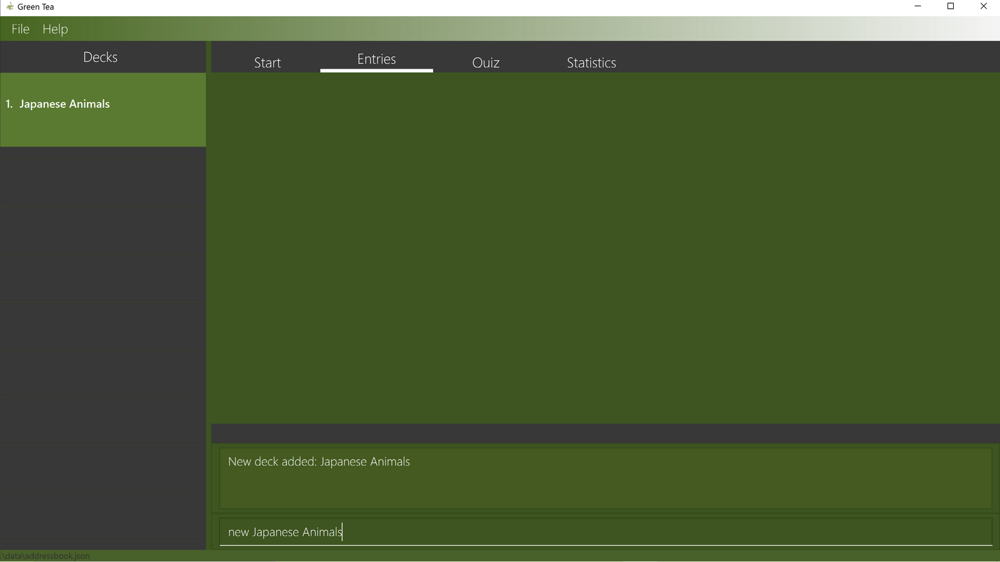
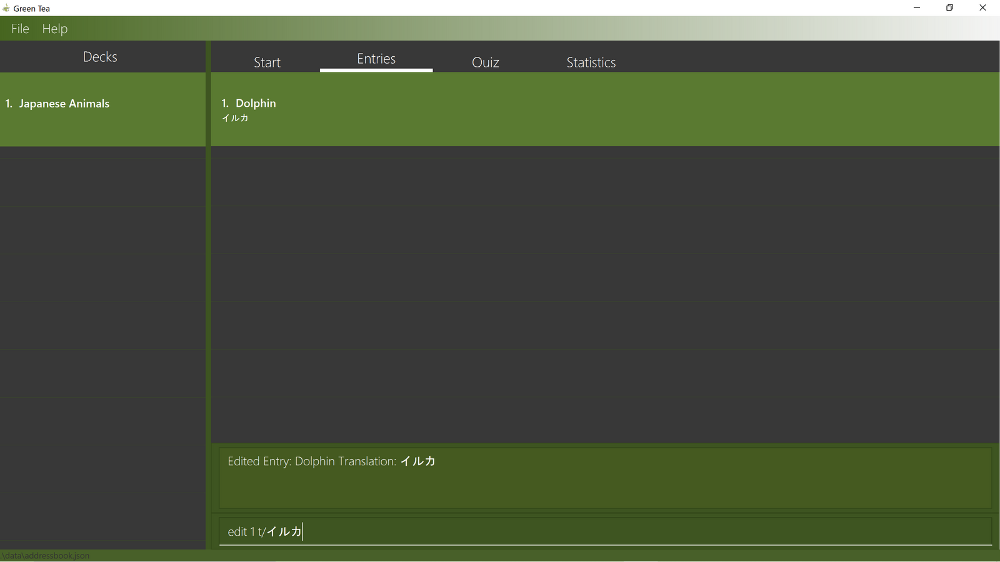
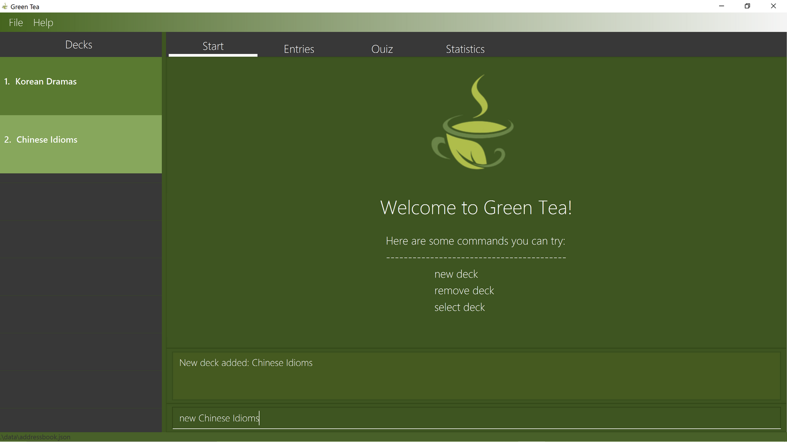
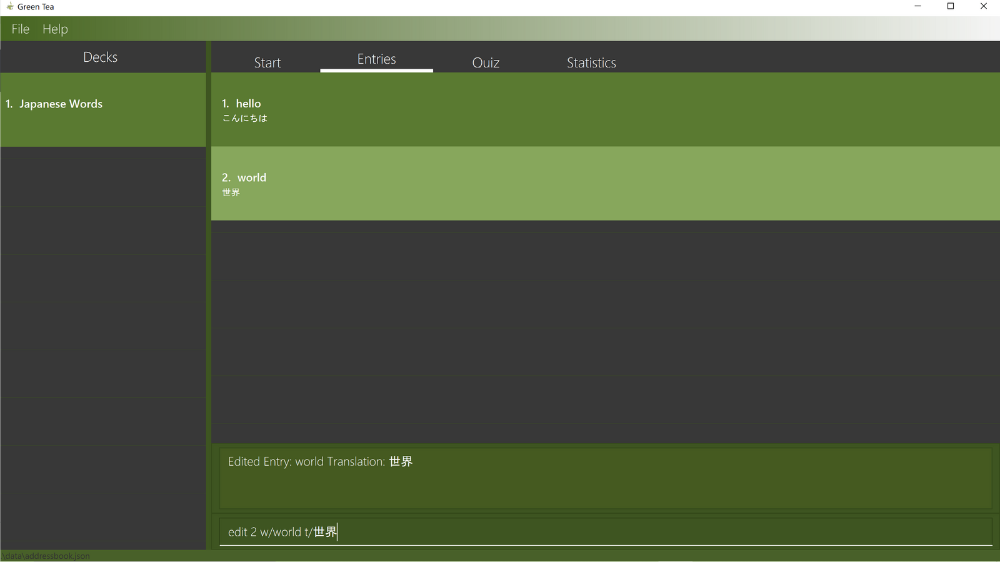
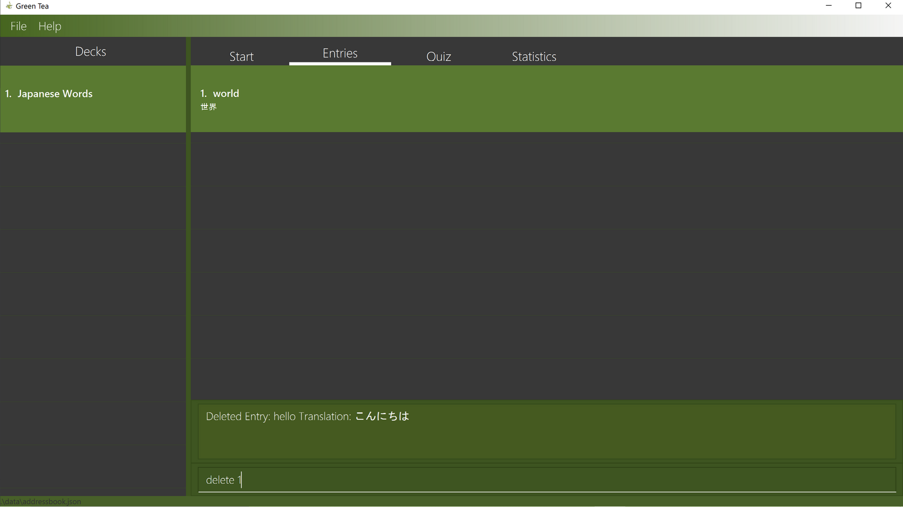
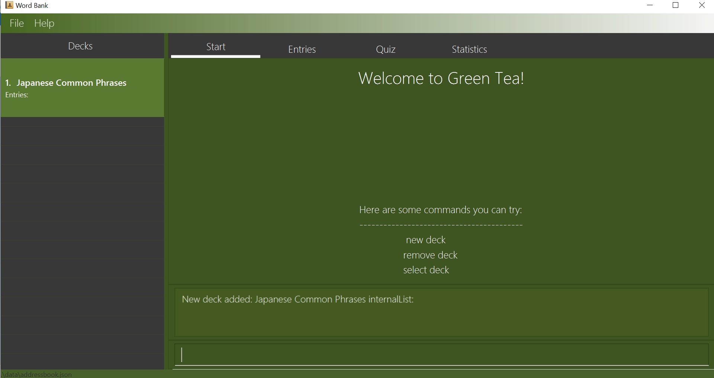

# User Guide

Team Name: AY2021S1-CS2103T-T09-4 Since: August 2020

## Table of Contents

- [1. What is GreenTea? (Gabriel)](#1-what-is-greentea-gabriel)
- [2. About This Document (Gabriel)](#2-about-this-document-gabriel)
- [3. Getting Started (Gabriel)](#3-lets-get-started-gabriel)
- [4. Using This Guide (Melanie)](#4-using-this-guide-melanie)
    - [4.1 Symbols](#41-symbols)
    - [4.2 Command Format](#42-command-format)
        - [4.2.1 Arrowed Brackets](#421-arrowed-brackets)
        - [4.2.2 Square Brackets](#422-square-brackets)
- [5. Features (Melanie)](#5-features)
    - [5.1 Deck Commands (Melanie)](#51-deck-commands-melanie)
      - [5.1.1 Creating a deck: new](#511-creating-a-deck-new)
      - [5.1.2 Removing a deck: remove](#512-removing-a-deck-remove)
      - [5.1.3 Selecting a deck: select](#513-selecting-a-deck-select)
    - [5.2. Entry Commands (Vignesh)](#52-entry-commands-gabriel)
      - [5.2.1 Adding a new entry: add](#521-adding-a-new-entry-add-vignesh)
      - [5.2.2 Editing an entry: edit](#522-editing-an-entry-edit-vignesh)
      - [5.2.3 Deleting an entry: delete](#523-deleting-an-entry-delete-vignesh)
    - [5.3. PLay Commands (Georgie)](#53-play-commands-georgie)
      - [5.3.1 Play a Game](#531-play-a-game-georgie)
      - [5.3.2 Stop a Game](#532-stop-a-game--georgie)
    - [5.4. Extra Commands (Georgie)](#54-extra-commands-georgie)
      - [5.4.1 Viewing help: help](#541-viewing-help-help)
      - [5.4.2 Exiting the program: exit](#542-exiting-the-program-exit)
- [6. Statistics (Melanie)](#6-statistics-melanie)
- [7. FAQ (Gabriel)](#7-faq-gabriel)
- [8. Command Summary (Gabriel)](#8-command-summary-gabriel)

# 1. What is GreenTea? (Gabriel)

GreenTea is a desktop app for **learning a new language** in a **fun** and **engaging** way.
GreenTea if **optimized for use via a Command Line Interface** (CLI) while still having the benefits of a Graphical User Interface (GUI).
GreenTea uses a proven memory retention system known as the [Leitner System](https://medium.com/@jessewhelan/using-the-leitner-system-to-improve-your-study-d5edafae7f0)
and implements it in the context of a FlashCard game. This app is great for users who wish to
optimize their time learning a new language. In this User Guide (UG), you will learn about the various commands and
actions that would allow you to use GreenTea seamlessly.

Figure 1. GreenTea's Graphical User Interface (GUI)

# 2. About This Document (Gabriel)

Welcome to the GreenTea User Guide!

We at GreenTea are happy that you have taken your first few steps towards optimising your learning. We at GreenTea know that
learning a new language can be **hard** and **intimidating**. Trust us when we say we know **exactly** what you're
going through and we feel **frustrated** just as much you do.

That's why here at GreenTea, we have come up with this neat
user guide to help **you** hit the ground running. With this foolproof User Guide, learning a new
language will be as relaxing as drinking a hot cup of GreenTea.

# 3. Getting Started (Gabriel)

Before you can start using GreenTea, you will need to ensure that [Java 11](https://www.java.com/en/)
is installed on your computer.

To start using GreenTea:

1. Download the latest jar file [here](https://github.com/AY2021S1-CS2103T-T09-4/tp/releases/new)
2. Copy the jar file to your folder of choice (we recommend on your desktop!)
3. Double-Click the file to start the application. The GUI should appear in a few seconds

Figure 2. Different parts of GreenTea's GUI

From Figure 2, there are four main components to the GUI. The deck list, the tab panels, the result display and the command box

1. Deck List - The deck list displays all the decks that you currently have in GreenTea. It will update as you keep adding decks.
2. Tab Panels - The main features of GreenTea are seperated into different tabs. The tabs will change automatically, depending on your
commands, so you do not need to worry about changing the tabs manually.
3. Result Display - The result display is where the outcome of your commands are shown. It will show you if your command has
been successfully carried out, or if there are errors in your command formats.
4. Command Box - The command box is where you type in all your commands. Pressing **enter** on your keyboard will execute the commands.

5. Try typing these commands to start playing with GreenTea

    - `new Japanese Animals`: Creates a new Deck called `Japanese Animals`
    
    Figure 3. New deck called Japanese Animals

    - `select 1` selects the first Deck `Japanese Animals`
    
    Figure 4. Selecting the first deck in the list

    - `add w/Dolphin t/Iruka`: Adds a new Entry into the selected deck with the word `Dolphin` and the translation `Iruka`
    
    Figure 5. Adding an entry

    - `edit 1 t/イルカ`: Edits first Entry and change the existing translation `Iruka` into `イルカ`
    
    Figure 6. Editing an entry

6. Refer to [Chapter 4 Features](#features) for a detailed explanation for each command.

# 4. Using This Guide (Melanie)

Before going into the features, lets get familiar with the symbols and command format used in this user guide

## 4.1 Symbols

:information_source: This symbol represents important information

:bulb: This symbol represents additional information

## 4.2 Command Format

Every feature can be accessed with a command and every command has a certain format that
has to be followed. The following is an explanation of how commands are described in this document.

### 4.2.1 Arrowed Brackets

Words in `<Arrowed Brackets>` are compulsory inputs supplied by you. They are generally names or translations that
are unique to each input.

E.g `new <NAME OF NEW DECK>` is a command that creates a new deck with the input, `NAME OF NEW DECK`

### 4.2.2 Square Brackets

Words in `[Square Brackets]` are optional inputs. They may or may not be added but __at least one__ is required

E.g The edit command `edit 1 [w/word] [t/translation]` can be written as `edit 1 [w/word]` or `edit 1 [t/translation]`
or `edit 1 [w/word] [t/translation]` __but cannot be written as__ `edit 1`

# 5. Features

In this section, we will go into each feature of GreenTea, along with their command format and examples.

## 5.1 Deck Commands (Melanie)

Decks are the foundation to GreenTea. A deck is simply a list of entries
you write into GreenTea. A deck can be your favourite Korean dramas or some Japanese words

### 5.1.1 Creating a deck: `new`

Creates a new empty deck with given name.

Format: `new <NAME OF NEW DECK>`

Examples:
- `new Korean Dramas`
- `new Japanese Words`

Result:

Figure 7. Result of creating new decks

### 5.1.2 Removing a deck: `remove`

Removes a deck with the given index.

Format: `remove <INDEX OF DECK>`

:information_source: **Note:**
To get the index of a deck, you may view it on the GUI. It would be the number displayed beside a particular deck.

Example: `remove 1`

Before a deck is removed:

Figure 8: GUI before a deck is removed

Result:

Figure 9. Result of removing a deck

### 5.1.3 Selecting a deck: `select`

Selects a deck with the given index and lists all of its entries.

Format: `select <INDEX OF DECK>`

:information_source: **Note:**
The index of the deck is the number displayed it on the user interface.

Examples: `select 1`

Result:

Figure 10: Result of selecting a deck

## 5.2 Entry Commands (Gabriel)

Entries are what make up a deck. They are the words or phrases that you wish to memorise in GreenTea.
An entry is made up of two parts; the `word` and the `translation`. The `word` is written in the
language you are most familiar and the `translation` is written in the language you wish to learn. In
this User Guide, we will be assuming the language for `word` will be in English.

:information_source: **Note:**
Before you start giving entry commands, remember to [select a deck first!](#513-selecting-a-deck-select)

:bulb: Fun fact: Did you know GreenTea supports over 100 languages including Telugu, Welsh and Xamtanga? To
see if your chosen language is supported, click [here!](http://www.unicode.org/charts/index.html)

### 5.2.1 Adding a new entry: `add` (Vignesh)

Adds a new entry with the given word and translation.

Format: `add w/<WORD> t/<TRANSLATION>`

Examples:

- `add w/Fruits t/果物`
- `add w/Phone t/電話`

Result:

Figure 11: Result of adding an entry

### 5.2.2 Editing an entry: `edit` (Vignesh)

Edits an entry with the given index using the given word or translation or both.

Format: `edit 1 [w/word] [t/translation]`

:information_source: **Note:**
The word and translation are both optional parameters. You can supply one parameter or both parameters but
you must supply at least one.

Examples:
- `edit 1 w/hello`
- `edit 1 t/こんにちは`
- `edit 2 w/world t/世界`

Result:

Figure 12. Result of editing an entry

### 5.2.3 Deleting an entry: `delete` (Vignesh)

Deletes the entry with the given index.

Format: `delete <INDEX>`

Example: `delete 1`

Before an entry is deleted:

Figure 13. GUI before an entry is deleted

Result:

Figure 14. Result of deleting an entry

## 5.3 Play Commands (Georgie)

Memory retention is the main goal of GreenTea. Thankfully, we have gotten rid of all
the complexities behind starting a new FlashCard game. In fact, there are only two commands in this section, `play` and
`stop`.

## 5.3.1 Play a Game (Georgie)

Plays the current deck. GreenTea will do a shuffle of the current deck and asks you what is the
the english `word` of a randomly selected `translation`. Your score will be recorded and displayed
to you at the end of the game.

Format: `play`

:information_source: **Note:**
Before you start playing a new game, remember to [select a deck first!](#513-selecting-a-deck-select)

Result:

Figure 15. Result of playing a game

## 5.3.2 Stop a Game  (Georgie)

Stop the current game prematurely.

Format: `stop`

:information_source: **Note:**
Before you start playing a new game, remember to [select a deck first!](#513-selecting-a-deck-select)

Result:

Figure 16. Result of stopping a game

## 5.4 Extra Commands (Georgie)

These are some extra commands that you can access at any point in the application except when
you are currently playing a game.

### 5.4.1 Viewing help: `help`

Shows a cheat-sheet of commands in addition to a link to this User Guide.

Format: `help`

Result:

### 5.4.2 Exiting the program: `exit`

Exits the program.

Format: `exit`

Result:

## 6. Statistics (Melanie)

Statistics are how you get to see your own progression as you continuously build and play GreenTea.
The statistics tab displays the scores of up to your last 10 attempts in the form of
a bar chart.

You can access the statistics tab by first `select`ing a deck before clicking the statistics tab at the top
of the application.

:information_source: **Note:**
Before you can view the statistics, remember to [select a deck first!](#513-selecting-a-deck-select)

Result:

## 7. FAQ (Gabriel)

**Q**: How do I transfer my data to another Computer? 
**A**: Install the app in the other computer and overwrite the empty data file it creates with the file that contains the data of your previous GreenTea home folder.

**Q**: Will my score be recorded if I stop a game before I finish it? 
**A**: Your score will be displayed to you after you pass a `stop` command but it will not be recorded in the statistics tab
---

## 8. Command Summary (Gabriel)

| Action                                                                                             | Format                                                                             |Examples |Remarks|
| -------------------------------------------------------------------------------------------------- | -----------------------------------------------------------------------------------|--------|--------|
| **New**                                                                                            | `new <NAME OF NEW DECK>` | `new Japanese-Animals`   |Creates a New Deck With the Given Name          |
| **Remove**                                                                                         | `remove <INDEX OF DECK>`  |`remove 1`    |Removes the Deck with the Given Index          |
| **Select**                                                                                         | `select <INDEX OF DECK>`  |`select 1`    |Selects the Deck with the Given Index and Lists All It's Entries         |
| **Add**                                                                                            | `add w/<WORD> t/<TRANSLATION>` | `add w/Hello t/hola`       |Adds an Entry with the Given Word and Translation to the Selected Deck|
| **Edit**                                                                                           | `edit 1 [w/word] [t/translation]` | `edit 1 w/hello t/こんにちは`   | Edits the Entry with the Given Index Using the Given Values|
| **Delete**                                                                                         | `delete <INDEX>` | `delete 3`                                                                     | Deletes the Entry with the Given Index|
| **Play**                                                                                           | `play`       |  | Starts a New FlashCard Game with the Selected Deck
| **Stop**                                                                                           | `stop`       | | Stops an Existing Game
| **Clear**                                                                                          | `clear`      |  | Deletes All Decks and Entries
| **Help**                                                                                           | `help`       | | Opens Our User Guide in the Application|
| **Exit**                                                                                           | `exit`       |  | Saves and Exits the Program
